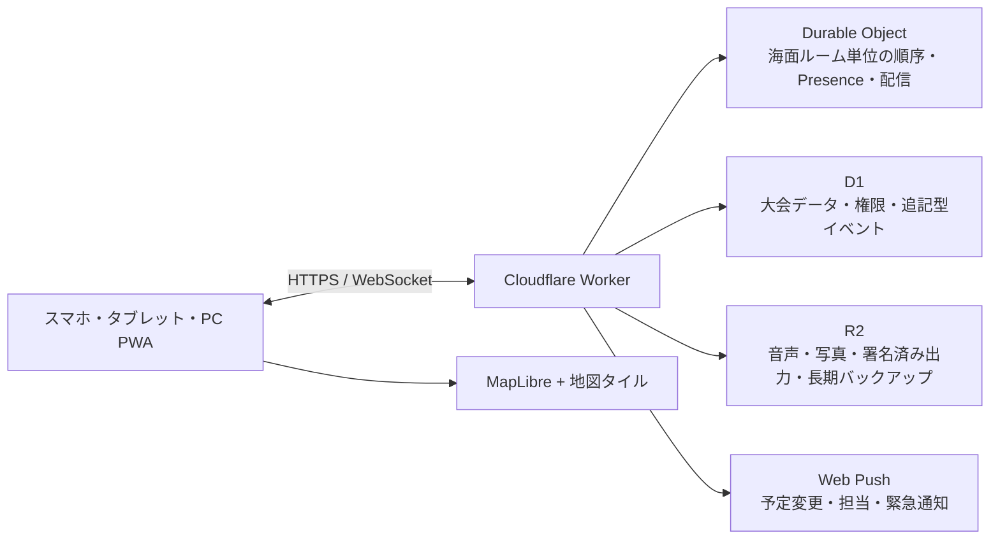

# Sailing Race Supporter 仕様書

- 文書バージョン: 0.2
- 状態: 協議中ドラフト
- 更新日: 2026-07-17
- 想定言語: 日本語を優先、英語対応可能な構造
- 主対象: スマートフォン。タブレット・PCにもレスポンシブ対応

## 1. 目的

本アプリは、セーリングレースのコース設計、マーク設置、風・潮流の観測、運営ボートの位置共有、レース時刻と信号の管理、運営記録を一つのリアルタイム地図上で扱うレース運営支援システムである。

参考サイト「マークレイヤーツール」のコース座標計算を包含し、次を上位機能として提供する。

- トラペゾイド、上下、上下ゲート、トライアングル、スタート／フィニッシュ、カスタムコースへの対応
- 競技ヨットのクラス（艇種）、風速、風向、潮流、海面状態、目標レース時間からの推奨コース長計算
- 常時表示される拡大縮小可能な地図
- 計画地点、実際のマーク投下地点、移動中の運営ボート位置の明確な区別
- マーク単位、運営ボート単位、レース海面単位のリアルタイム共有
- 各マーク・各周回で、先頭の競技ヨットが最初に通過した時刻の記録・共有
- 大会固定URL内での1R、2R等の切替、レース確定、確定後ロック
- 大会、海面、レース、運営ボート、マーク単位のリアルタイムメッセージ
- 役割と担当範囲に基づく権限管理
- 改ざん検知可能な操作履歴、版管理、ロールバック
- レース予告時刻、リマインド、スタートシーケンス、タイマー
- URLごとに分離されたログとエクスポート
- 通信が不安定な海上を前提にしたオフライン継続と再同期

本アプリは海図、航海計器、法定安全設備の代替ではない。地図と位置情報には誤差や欠落があり得るため、安全上の最終判断とレース運営上の決定は権限を持つ人が行う。

## 2. 設計原則

1. **地図中心**: どの主要画面でもコースと現在状況を見失わない。
2. **計画と事実の分離**: 目標地点、投下地点、現在の運営ボート位置を同じ座標として扱わない。
3. **提案と決定の分離**: アプリはコース長や変更を提案するが、公開・変更の決定はRO/PROが承認する。
4. **時刻と出典の明示**: 風、位置、信号、指示には観測時刻、観測者、取得元、精度を付ける。
5. **追記型の記録**: 履歴を上書きせず、訂正や復元も新しい履歴として残す。
6. **海上で使えること**: 大きな操作対象、高コントラスト、片手操作、日光下、濡れた手、低速回線を想定する。
7. **帆走指示書を優先**: 規則プリセットは補助であり、大会のNoR/SIに合わせて変更可能にする。

### 2.1 用語と計測対象

日本語UIと本仕様では、曖昧さを避けるため次の用語を使う。

| 用語 | 意味 |
|---|---|
| 競技ヨット | セーリング競技に参加し、帆走してコースを回る艇 |
| 運営ボート | レース委員会、安全、ジュリー等が使用する、主として動力で航行する公式・支援船舶の総称 |
| マークボート | マークの設置、確認、移動、回収を担当する運営ボート |
| シグナルボート | スタート・フィニッシュ信号や本部機能を担当する運営ボート |
| ピンエンドボート | スタートラインのピンエンド側を担当する運営ボート |
| 安全ボート | 安全監視・救助支援を担当する運営ボート |
| ジュリー／プロテストボート | 水上で審判・観察を行う運営ボート |
| マーク | コースを示すブイその他の物体。ボートとは呼ばない |

RRS英語原文の定義語 `boat` が競技艇を指す引用箇所では、その文脈を明記する。通常の日本語UIで単に「ボート」と表示せず、「競技ヨット」または具体的な運営ボート種別を表示する。

本アプリは、競技中の競技ヨットへのGPS端末搭載を要求せず、そのライブ位置、SOG、COG、船首方位、艇速を収集・表示しない。競技ヨットについて記録するのは、スタート、先頭通過、フィニッシュ等の運営者が観測した時刻・識別情報である。速度・角度・位置をリアルタイム共有する対象は運営ボートである。

## 3. 調査した現行サイトとの差分

現行サイトは、トライアングル、トラペゾイド、LR、LG、スタートについて、風軸、基準点、距離比、内角、ゲート幅からマーク座標を計算する単独利用型のツールである。端末位置の取得と別画面の地図表示はあるが、次は持たない。

- 地図を見ながらの全操作
- 競技ヨットクラス・風速・目標時間からのコース長最適化
- 運営ボートと投下済みマークの同時表示
- 複数人のリアルタイム共同作業
- 役割別権限、招待の失効、監査履歴
- 計画位置と投下位置の差分管理
- オフライン編集と再同期
- レース時刻、信号、リマインド、運営ログ

現行サイトでは位置や設定値をURLクエリに含めて別ページへ渡す実装が見られる。新アプリでは、精密位置を共有URLに埋め込まない。

## 4. 利用者と役割

| 役割 | 主な責務 |
|---|---|
| 大会管理者（大会オーナー） | 大会を作成して固定URLを発行した本人。大会、海面、ユーザー、保存期間、競技ヨットクラスプロファイルを管理し、確定後修正ができる唯一の役割 |
| PRO / RO | コース、時刻、信号、延期・中止・短縮・変更の最終承認 |
| コースセッター | 風・潮流の評価、コース案とマーク目標地点の作成 |
| シグナルボート | スタート／フィニッシュ地点、時刻、信号、音響、先頭通過・フィニッシュ記録 |
| マークボート責任者 | 担当マークボートと担当マークの割当、投下・移動・回収の管理 |
| マークボートメンバー | 自運営ボートの位置共有、担当マークの投下・確認、風・潮流・先頭通過報告 |
| ピンエンドボート | スタートライン端の設置、ライン情報、OCS観測補助 |
| 安全ボート | 安全区域、支援要請、運営ボートの状態、位置共有 |
| ジュリー／プロテストボート | 自運営ボート位置、観測、時刻付きメモ、証拠参照。コース変更権限は持たない |
| 記録員／タイムキーパー | 信号、先頭通過、フィニッシュ、インシデントの記録 |
| 閲覧者 | 許可された海面・艇・ログの閲覧のみ |

権限は役割だけでなく、海面、運営ボート、マーク、レースの範囲で限定できる。例えば「第1マークボートのメンバー」は第1マークの投下と先頭通過を記録できるが、第2マークやコース全体は変更できない。大会管理者は大会作成者一人を原則とし、単なる管理者招待やPRO/ROへの任命では大会オーナー権限を付与しない。

## 5. 基本データ単位

階層は次の通りとする。

`大会（固定共有URL） > レース日 > レース海面 > リアルタイムルーム（内部） > レース > フリート`

- **大会**: 利用者が共有・ブックマークする固定URLの単位。複数日、複数海面、複数レースを含む。
- **リアルタイムルーム**: イベント順序制御と配信を分離する内部単位。例「7月17日 A海面」。利用者に別の共有URLを要求しない。
- **レース**: 第1レース、第2レースなどの運営・ログ単位。
- **コース改訂**: ある時点でROが承認したコース形状と位置の版。
- **マーク目標**: コース計算上の設置予定地点。
- **マーク投下イベント**: 実際にマークを投下・再投下した地点と時刻。
- **運営ボート位置**: 運営ボート上の端末が示す流動的な現在地。

位置座標はWGS 84で保存する。距離は内部的にはメートル、速度はm/s、時刻はUTCで保存し、表示時にm/nm、kt/m/s、ローカル時刻へ変換する。

方位は必ず次を区別する。

- 真方位（True）
- 磁方位（Magnetic）
- 進行方向（COG。GPS移動ベクトル）
- 船首方位（Heading。端末コンパスまたは外部センサー）
- 目標地点への方位（Bearing to target）

磁気偏角の変換にはWMM2025を使用し、モデル版と計算日を記録する。表示の初期値は大会設定で磁方位／真方位を選べる。

## 6. 大会とレース運営のライフサイクル

1. 大会・固定共有URL・海面・対象競技ヨットクラス・参加艇数・NoR/SI設定を登録する。
2. 大会配下に役割・運営ボート・マーク別の招待URLを発行する。
3. 風、潮流、海面状態、目標時間からコース案を作成する。
4. ROがコース案を承認し、各マークボートへ設置タスクを配信する。
5. 各マークボートが目標地点へ移動し、投下地点を記録する。
6. コース準備状況を確認し、予告時刻・スタートシーケンスを実行する。
7. レース中は風の変化、運営ボート位置、マーク状態、各マークの先頭通過、信号、変更指示を共有する。
8. フィニッシュ・マーク回収・運営ボート帰着を記録し、ログを確定・署名・出力する。
9. 先頭通過とフィニッシュの実績時間を競技ヨットクラスプロファイルの校正候補として保存する。

## 7. 地図仕様

### 7.1 常時表示

- スマートフォン縦画面では地図を上部に固定し、操作パネルを下部のボトムシートにする。
- ボトムシートを広げても、地図を画面高の40%以上残す。
- タブレットとPCでは、地図60〜70%、情報パネル30〜40%の分割表示を基本とする。
- 主要操作中に別ページへ遷移させず、地図上またはボトムシートで完結させる。
- ピンチズーム、ダブルタップ、パン、現在地追従、コース全体表示、北固定、進行方向上表示に対応する。

### 7.2 表示レイヤー

| 対象 | 表現 |
|---|---|
| マーク目標地点 | 中抜きのマーク記号、点線のコース |
| 投下済みマーク | 塗りつぶし記号、投下時刻と精度 |
| 旧／移動前マーク | 薄い記号。履歴モード以外では自動的に弱調表示 |
| 運営ボート | 船型または三角矢印。COG方向、SOGに応じたベクトル長 |
| 船首方位 | COG矢印と別色の短い方位線。取得できる場合のみ |
| 担当目標 | 運営ボートから目標への破線、残距離、ETA |
| 目標と投下地点の差 | 誤差線、距離、方位、風軸方向誤差、横方向誤差 |
| 風 | 観測地点ごとの矢羽、海面平均、振れ幅、鮮度 |
| 潮流 | 流向・流速ベクトル、観測地点、鮮度 |
| スタート／フィニッシュ | 両端点、ライン、長さ、風に対する角度、バイアス |
| ゲート | 2点、中央、幅、風に対する直角誤差 |
| GPS精度 | 選択中の点または艇に精度円 |
| 航跡 | 運営ボートについて運営上必要な期間のみ表示。権限と保存期間を適用 |
| 制限区域 | 陸岸、浅所、航路、立入禁止、スポンサー／撮影区域などの任意ポリゴン |

色だけに依存せず、形、線種、ラベルも併用する。古い位置には「最終更新からの秒数」を表示し、30秒を超えたら明確に「古い位置」と扱う。

### 7.3 ベースマップ

- MapLibre GL JSを使用し、地図タイル提供元は差し替え可能にする。
- 通常地図に加え、利用条件を確認した上で航路標識等の海洋レイヤーを重ねられるようにする。
- 航海用電子海図としての正確性を保証しない旨を常時確認できるようにする。
- OSM標準タイルはオフライン用の一括取得を認めていないため、オフライン地図が必要な場合は許諾されたプロバイダーまたはセルフホストのベクトルタイルを使用する。
- ベースマップが取得できない場合も、座標グリッド、コース、マーク、運営ボート、風、距離は表示し続ける。

## 8. コース設計

### 8.1 標準テンプレート

初期テンプレートとして次を提供する。

- トラペゾイド・アウターループ
- トラペゾイド・インナーループ
- 風上／風下（1周、2周以上）
- 風上／風下ゲート
- LR / LG相当の風下フィニッシュ／風上フィニッシュ
- トライアングル
- オリンピック型トライアングル＋風上／風下
- スタートラインのみ
- フィニッシュラインのみ
- リーチングスタート／リーチングフィニッシュ
- スラローム
- 固定マークを利用する湾内コース
- カスタムコース

カスタムコースは、マーク、ゲート、ラインをノード、帆走するレグをエッジとするグラフとして編集する。各マークは回航方向、色、形、名称、代替マーク、担当マークボートを設定できる。

### 8.2 コース寸法

- 風軸、基準点、基準レグ長、各レグの距離比、内角、周回数を設定可能にする。
- トラペゾイドのMark 1–2は、World Sailing運営方針の約2/3をプリセットとするが、大会設定で変更できる。
- リーチ角は、スピネーカー使用クラス120°、非スピネーカー使用クラス・ボード110°を初期提案とし、競技ヨットクラスプロファイルまたはSIで上書きできる。
- ゲート幅の初期提案は約10艇身とし、潮流、海面、艇数、SIにより変更できる。
- スタートライン長の初期提案は `参加艇数 × 艇長 × クラス係数` とし、クラス係数を編集可能にする。
- 地理計算にはWGS 84楕円体上の測地線計算を用いる。

### 8.3 コース変更

- 現行コースと変更案を同時に保持する。
- 変更案は「ゴーストマーク」として表示し、担当マークボートにのみ先行共有できる。
- RO承認後に変更案を公開し、C旗、新方位、赤／緑、距離の+／−などの必要信号チェックを表示する。
- 投下前でも次マーク位置の変更指示を作成できる。
- 移動前、移動指示、再投下、確認の全履歴を残す。
- 風向変化が10°、15°、45°の運営目安を超えた場合は通知候補を出すが、自動でコースを変更または中止しない。

## 9. 競技ヨットクラス・風速によるコース長最適化

### 9.1 入力

- 競技ヨットクラス（艇種）または複数クラス
- フリートごとの目標先頭艇時間
- コーステンプレートと周回数
- 5分平均風速、風向、振れ幅、ガスト
- 潮流の流向・流速
- 海面状態（平水、チョップ、うねり、強いうねり）
- 参加艇数
- 使用可能なレース海面境界と安全制限
- 競技ヨットクラスのパフォーマンスプロファイル版
- 必要に応じて気温、視程、日没、安全上限・下限

### 9.2 競技ヨットクラスのパフォーマンスプロファイル

競技ヨットクラスごとに、風速帯と真風向角に対する次の参考値を持つ。

- 風上VMG
- 風下VMG
- リーチ艇速または目的方向への実効速度
- タック・ジャイブ・回航による時間損失
- 軽風・プレーニング・フォイリングへの遷移特性
- 海面状態補正
- 艇長、リグ種別、スピネーカー有無、ボード／スキフ／マルチハル等の分類
- データの出典、承認者、作成日、信頼度、版

World Sailingのクラス規則だけでは風速別の完全なポーラーデータが揃わないため、初期データを絶対値として扱わない。主催者がCSV等で登録でき、実レース結果から校正候補を作る。

校正は自動反映せず、次の流れとする。

1. 各マーク・各周回の先頭競技ヨット通過時刻、フィニッシュ時刻、平均風、コース実長、海面状態を記録する。
2. 予測と実績の差を風速帯・競技ヨットクラス別に算出する。
3. 補正案とサンプル数を提示する。
4. 管理者が新しいプロファイル版として承認する。

このプロファイルはコース設計用のクラス集約モデルであり、競技中の個別ヨットの艇速測定ではない。先頭通過時刻からクラス全体の所要時間モデルを校正しても、個別競技ヨットの区間艇速や航跡は計算・表示しない。

### 9.3 計算モデル

各レグの基準レグ長に対する比を `r_i`、実効進行速度を `V_i`、固定時間損失を `tau`、基準レグ長を `D` とする。

```text
予測先頭艇時間 T(D) = tau + Σ (D × r_i / V_i)

推奨基準レグ長 D* = (目標時間 - tau) / Σ (r_i / V_i)
```

風上・風下レグの `V_i` は艇速ではなくVMGを用いる。リーチは相対風向に対する艇速を目的方向へ投影する。潮流は各レグ方向への成分として補正し、危険な極小値にならない制約を持たせる。

複数クラスが同じコースを使用する場合、各クラスの目標時間に対する相対誤差の加重二乗和が最小となる長さを提案する。同時に各クラスの予測時間を個別表示し、妥協が不適切な場合は別コース、別周回数、短縮候補を提案する。

### 9.4 出力

- 推奨基準レグ長と各レグ長（m/nm）
- マーク・ゲート・ラインの目標座標
- 競技ヨットクラスごとの予測先頭艇時間
- 予測時間の幅と信頼度
- 風速または風向が変わった場合の感度
- スタートライン長、ゲート幅、フィニッシュライン長の提案
- 海面境界・浅所・他海面との干渉警告
- 変更後の推奨距離と変更率

World Sailing運営方針にある「目標時間から20%以上外れる見込み」や「変更後のレグ長50〜150%」は注意喚起プリセットとして提供する。大会ごとに無効化・変更できる。

## 10. 風・潮流・海面情報

### 10.1 風観測

- 観測値: 風向、平均風速、ガスト、最低値、振れ幅、観測時間、観測位置、艇、観測者、機器
- 方位種別: 真方位／磁方位
- 観測方法: 手入力、外部センサー、艇上計器、API、推定
- 艇の状態: 漂流中、錨泊中、航走中。航走中の値は補正済みかを記録する。
- 1分、3分、5分等の窓を選択でき、5分平均を標準表示する。
- 風向平均は0°/360°を正しく扱う円統計で計算する。
- 海面全体、上マーク付近、下マーク付近等の差を表示する。
- 変化がない報告も「変化なし」として時刻を更新できる。

### 10.2 潮流

- 流向、流速、観測位置、観測時刻、観測方法、信頼度を共有する。
- 漂流測定では開始点・終了点・経過時間を記録し、自動計算する。
- スタートライン、ゲート、各レグへの横流れ・追い流れ成分を表示する。

### 10.3 安全・環境

- 視程、波高・うねり、雷、急変、漂流物、一般船舶、航路干渉を時刻付きで記録する。
- 緊急状態は通常ログと別の高優先度イベントとし、全対象端末へ目立つ通知を出す。
- Flag V等の安全手順を大会設定として登録し、VHFチャンネルと行動チェックを表示できる。

## 11. マーク運用

### 11.1 状態

`計画中 → 承認済み → 担当割当 → 移動中 → 投下済み → 確認済み → 移動指示 → 再投下 → 回収済み`

例外状態として、投下失敗、アンカー走錨疑い、紛失、代替マーク、回収不能を持つ。

### 11.2 投下記録

「マーク投下」は次を一つの不可変イベントとして記録する。

- マークIDとコース改訂版
- 投下時刻（サーバー時刻と端末時刻）
- 投下時点の緯度経度
- GPS精度
- 投下したマークボートと実行者
- 目標地点との差
- 風向・風速・潮流の最新値
- 任意のメモ、写真、アンカー／水深情報

GPS精度の初期表示は、5m以下を良好、5〜15mを注意、15m超を不良とする。しきい値は大会設定で変更できる。不良時は長押し確認と理由入力を要求する。

投下後にマークボートが移動しても投下地点は動かない。地図には投下地点とマークボートの現在地を別々に表示し、必要に応じて両者間の距離と方位を表示する。

### 11.3 マーク位置の検証

- 投下したマークボート以外の運営ボートから「位置確認」を記録できる。
- 複数確認値の差、時間差、GPS精度から走錨疑いを出せる。
- マーク自体にGPSトラッカーがある場合は、運営ボート位置とは別のデータ源として接続する。
- 走錨や移動を断定せず、「投下地点からの観測差」として表示する。

### 11.4 先頭競技ヨットの初回通過時刻

各レースの各マーク訪問について、その訪問で最初の競技ヨットが通過した時刻を記録する。同じマークを複数回使用するコースでは、`マークID + 訪問番号（周回・レグ）` で別の観測対象として扱う。「先頭」は訪問ごとの最初の競技ヨットを意味し、毎回同じ競技ヨットである必要はない。

担当マークボートのライブ画面には、レース開始後、その訪問に対応する大きな「先頭通過」ボタンを表示する。押下時に次を不可変イベントとして記録する。

- 大会、レース、フリート、コース改訂版
- マークID、訪問番号、周回、直前レグ
- 観測時刻、スタートからの経過時間、直前の先頭通過からのスプリット
- 観測者、観測した運営ボート、端末ID
- サーバー時計との差、同期品質、GPS精度、オフライン状態
- 任意のセール番号／バウ番号、メモ、写真、音声

競技ヨットへのトラッカー搭載や艇速計測は行わず、担当者の目視タップを第一の記録方法とする。通信断中も端末の単調増加時計と直近のサーバー時計オフセットで記録し、再接続時に観測時刻と送信時刻を分けて同期する。

- 複数の観測者が押した場合も全記録を保持し、指定記録員が採用記録を確定する。
- 観測差が大会設定値（初期値2秒）を超えた場合は警告し、自動平均や上書きをしない。
- 押し間違いは削除せず、「取消」または「訂正」イベントを追記する。
- 記録後ただちにPRO/RO、タイムキーパー、次のマークボートへ共有する。
- ライブ目標時間予測とクラスプロファイル校正には使用できるが、個別競技ヨットの区間艇速は算出・表示しない。
- レース確定時に採用記録を固定し、通常権限では変更・削除・再採用できない。大会管理者が修正する場合も元記録を保持し、新しい確定版としてのみ追加できる。

## 12. 運営ボートの速度・角度・位置

各運営ボートについて次をリアルタイム表示する。

- 現在位置、水平精度、最終更新時刻
- 対地速力 SOG（kt）
- 進行方向 COG（真／磁）
- 船首方位 Heading（取得可能な場合）
- 目標地点までの距離と方位
- COGと目標方位の差（右／左何度）
- 目標方向への接近速度
- 到着予想時間 ETA
- 目標経路からの横ずれ XTE
- 担当タスクと状態
- 端末の通信状態と、取得可能ならバッテリー状態

Web Geolocationのspeedまたはheadingが取得できない場合、連続する有効なGPS位置からSOG/COGを推定する。低速・停止中はCOGが不安定になるため、初期しきい値0.5kt未満では方向を「—」とし、最後の有効値と混同しない。

GPSのheadingは船首方位ではなく移動方向である。端末コンパスによる船首方位は、端末を運営ボートの前後軸に合わせた校正操作をした場合だけ表示し、精度不明の場合は「参考」と明記する。将来はNMEA 0183/2000、Bluetooth GPS、AIS等の外部センサー入力を追加可能にする。

位置送信頻度の初期値は、移動中2秒、停止中10秒とし、通信・電池・速度に応じて適応させる。位置更新はリアルタイム配信用と保存用を分離し、D1には間引いた位置または重要イベントのみ保存する。

## 13. リアルタイム共有

### 13.1 共有範囲

- 大会全体
- 特定のレース海面
- 特定のレース（1R、2R等）
- 特定の運営ボートとそのメンバー
- 特定のマークまたはゲート
- 風・潮流観測のみ
- ログ閲覧のみ

クライアントは接続時に現在のスナップショットと最終連番を受け取り、その後は順序付きイベントをWebSocketで受信する。再接続時は不足イベントを再取得する。

### 13.2 競合と再送

- 各操作に一意なidempotency keyを付け、電波断による二重投下記録を防ぐ。
- コース編集は基準版番号を送り、古い版への編集は自動上書きしない。
- 投下、信号、緊急報告等はオフラインキューに保存し、再接続後にサーバー時刻と端末時刻の両方を保持して同期する。
- RO承認済みコースに対する変更は、権限があっても変更案として作成し、承認操作を分離する。

### 13.3 鮮度

- 位置、風、潮流、タスクに最終更新時刻を表示する。
- 標準で5秒以内をライブ、5〜30秒を遅延、30秒超を古い情報とする。
- 接続断中は、地図上のアイコンを消さず、古いことを明示する。

### 13.4 運営メッセージ

大会固定URLの中で、運営メンバー同士が短いメッセージをリアルタイムに交換できる。チャンネルは権限に応じて自動参加させる。

- 大会全体
- レース海面
- 1R、2R等のレース
- 特定の運営ボートとそのメンバー
- 特定のマークまたはゲート
- PRO/RO、マークボート、安全ボート等の役割グループ
- 1対1の運営連絡

メッセージには本文、送信者、送信時刻、対象レース、優先度、返信元、編集状態を持たせ、次を添付できる。

- マーク、ゲート、運営ボート、コース改訂版への参照
- 地図上の一時ピンと緯度経度
- 風・潮流・安全報告への参照
- 写真、短い音声、定型報告

優先度は「通常」「要確認」「緊急」とする。「要確認」「緊急」は対象者ごとの配信済み、既読、確認済みを表示し、未確認者へ再通知できる。緊急メッセージは通常チャットに埋もれない固定バナーと音・振動で通知する。

- VHF等の公式・安全通信を置き換えるものではなく、使用チャンネルと通信手順を大会設定に併記する。
- 海上操作を妨げないよう、定型文、音声入力、ワンタップ返信（了解／対応中／完了／再送願う）を提供する。
- オフライン送信はキューに保存し、「未送信」を明示する。緊急通信は未送信なら画面上で代替手段を促す。
- 送信済み本文を無痕跡で編集・削除できない。訂正は元メッセージを残した訂正メッセージとして追記する。
- レース確定時点までのレースチャンネルは確定スナップショットに含める。確定後も大会管理者は運営連絡を追記できるが、確定前メッセージの原文は変更しない。
- チャンネルごとに通知、メンション、ミュート、保存期間を設定できる。ただし緊急チャンネルは完全ミュート不可とする。

## 14. 大会URL、招待と権限

### 14.1 大会固定URL

大会ごとに、開催期間を通して変わらない正規URLを一つ発行する。

```text
https://app.example.jp/e/{event-id-or-slug}
```

- 大会URLは、複数日、複数海面、1R、2R以降の全レースへ移動する入口とする。
- レース切替後も大会URL自体は変えず、選択中のレースは画面状態または配下ルートで表現する。
- 深いリンクは `/e/{event-id}/areas/{area-id}/races/{race-id}` とし、アクセス権確認後に同じ大会画面内の対象レースを開く。
- 大会の公開識別子またはslugは秘密情報ではない。閲覧権限は招待、ログイン、認証セッションで判定する。
- 大会を新規作成してこのURLを発行した認証済みユーザーを、その大会の唯一の「大会管理者（大会オーナー）」として記録する。
- 任意で、正確な位置を含まない読取専用の大会ホーム（予定、レース状態、公式文書リンク）を公開できる。
- ログ、地図、設定、メンバー、運営ボート、マークはすべて大会URLを起点に移動・絞り込みできる。
- リアルタイム配信は日・海面等で内部ルームに分割できるが、利用者に新しい共有URLへの参加を要求しない。

### 14.2 招待URL

招待リンクは、役割、対象海面、艇、マーク、期限、使用回数を持つ。

例:

```text
https://app.example.jp/e/{event-id}/join/{invite-id}#token={secret}
```

秘密値はURLフラグメントに置き、最初のHTTPリクエスト、アクセスログ、Refererに送らない。アプリが秘密値を一度だけ交換し、HttpOnly・Secure・SameSite付きセッションCookieを発行した後、ブラウザ履歴を大会固定URLへ置換して秘密値を除去する。

- 秘密値は十分な乱数で生成し、サーバーにはハッシュのみ保存する。
- 読取専用、1回限り、複数人用、期限付き、無期限を選べる。
- いつでも失効・再発行できる。
- 重要権限はリンクだけで恒久付与せず、表示名の登録と任意のパスキー認証を要求できる。
- 緯度経度、権限、内部IDを共有URLに直接含めない。

### 14.3 権限の初期方針

| 操作 | 管理者 | PRO/RO | コースセッター | 担当マークボート | シグナルボート | ジュリー／プロテスト | 閲覧者 |
|---|---:|---:|---:|---:|---:|---:|---:|
| 大会設定 | 可 | 一部 | 不可 | 不可 | 不可 | 不可 | 不可 |
| コース案作成 | 可 | 可 | 可 | 不可 | 不可 | 不可 | 不可 |
| コース公開・変更承認 | 可 | 可 | 不可 | 不可 | 不可 | 不可 | 不可 |
| 担当マーク投下 | 可 | 可 | 可 | 可 | 不可 | 不可 | 不可 |
| 自運営ボート位置共有 | 可 | 可 | 可 | 可 | 可 | 可 | 任意 |
| 風・潮流報告 | 可 | 可 | 可 | 可 | 可 | 可 | 不可 |
| 担当マークの先頭通過記録 | 可 | 可 | 可 | 可 | 可 | 可 | 不可 |
| 許可チャンネルへのメッセージ送信 | 可 | 可 | 可 | 可 | 可 | 可 | 不可 |
| 信号・タイマー確定 | 可 | 可 | 不可 | 不可 | 可 | 不可 | 不可 |
| レース確定 | 可 | 可 | 不可 | 不可 | 不可 | 不可 | 不可 |
| 確定後修正版の作成 | 可 | 不可 | 不可 | 不可 | 不可 | 不可 | 不可 |
| ロールバック提案 | 可 | 可 | 可 | 不可 | 不可 | 不可 | 不可 |
| ロールバック承認 | 可 | 可 | 不可 | 不可 | 不可 | 不可 | 不可 |
| ログ閲覧 | 可 | 可 | 可 | 担当範囲 | 可 | 許可範囲 | 許可範囲 |

大会ごとに変更できるが、権限拡大は管理者またはPROの監査対象操作とする。

## 15. レース予定、リマインド、タイマー、信号

### 15.1 予定

- レース番号、フリート、予告信号予定時刻、目標スタート時刻、目標時間、タイムリミットを登録する。
- 大会内に1R、2R、3R等を作成し、海面・フリートごとに選択中のレースをワンタップで切り替えられる。
- レース切替時は、レース番号、状態、クラス、スタート時刻、コース版を固定ヘッダーに表示し、別レースへの誤記録を防ぐ。
- 進行中のレースがある状態で別レースへ切り替えても、タイマーとリアルタイム処理はバックグラウンドで継続する。
- 同一海面で原則一つのレースを「進行中」にする。複数フリートを同時進行できる設定では、フリート別に明示する。
- 「最早予告時刻」「予定予告時刻」「次の予告まで」を区別する。
- 延期、ゼネラルリコール、再スタート、短縮、中止、次レースへの切替を状態として扱う。
- 予定変更は対象者へプッシュ通知し、既読／未読を確認できる。

### 15.2 スタートシーケンス

標準プリセットとしてRRS 26の5・4・1・0分シーケンスを持つ。

- 5分: クラス旗、予告信号
- 4分: P/I/Z/Z+I/U/黒旗等、準備信号
- 1分: 準備旗降下、長音
- 0分: クラス旗降下、スタート

NoR/SIで変更された数値式スタート、メダルレース、リーチングスタート等をテンプレートとして追加できる。時間は視覚信号を基準に記録し、音響信号は別項目として記録する。

- サーバー時刻とのずれを測定し、全端末で同じカウントダウンを表示する。
- 通信断後も端末の単調増加時計で継続し、再接続時に補正する。
- 音、読み上げ、振動、全画面色変化を個別設定できる。
- 誤操作防止のため、開始・延期・リコール・中止は大きなボタンと確認動作を使う。

### 15.3 運営リマインド

- 「予告20分前までにMark 1確認」
- 「5分平均風を更新」
- 「スタート90秒前から録音開始」
- 「最終レグ開始前にフィニッシュライン準備」
- 「バッテリー／通信／GPS精度確認」
- 「レース後に全マーク回収・全艇帰着確認」

リマインドは大会テンプレート、役割、レース状態、絶対時刻、相対時刻から作成する。

### 15.4 レース状態と確定ロック

レースは次の状態を持つ。

`下書き → 準備中 → 進行中 → 暫定完了 → 確定済み（通常ロック）`

- 切替タブには、1R等の番号と状態を常時表示する。
- 「確定」はPRO/ROまたは大会管理者だけが実行できる。
- 確定前に、スタート時刻、採用コース版、先頭通過、フィニッシュ、信号、未同期端末、未解決の競合をチェックリストで確認する。
- 確定操作では対象レース名と件数を示し、再認証と「1Rを確定」の明示入力を要求する。
- 確定時にレースの全確定イベント、採用値、コース版、権限スコープから固定スナップショットとハッシュを作成する。
- 確定後は、PRO/ROを含む大会管理者以外の全員が編集、削除、差し替え、再オープン、ロールバックできない。APIとDBアクセス層でも拒否する。
- 大会URLを発行した大会管理者だけが「管理者修正モード」を開始できる。開始には再認証、修正理由、対象項目の選択を必須とする。
- 管理者修正でも元の確定版を直接更新・削除しない。元版を固定したまま修正版を新しい版（例: 確定版v2）として作り、差分、理由、管理者、時刻を表示する。
- 修正版を公開するには大会管理者が再確定する。再確定までは「管理者修正中」と明示し、一般利用者には最後に確定した版を表示する。
- 修正履歴はすべて閲覧・エクスポートでき、以前の確定版を隠さない。修正版の誤りには、さらに新しい修正版を作る。
- 他のレースは独立して編集・進行・確定できる。1Rの確定は2Rの作成・運営を妨げない。

## 16. ログ、改ざん検知、ロールバック

### 16.1 ログ対象

- ログイン、招待使用、権限変更
- コース案、承認、変更、復元
- マーク割当、投下、確認、移動、回収
- 風、潮流、海面、安全報告
- 予告、準備、1分、スタート、延期、リコール、短縮、中止、フィニッシュ
- 各マーク・各訪問の先頭競技ヨット通過、採用、取消、訂正
- レース切替、暫定完了、確定、管理者修正版の作成・再確定
- メッセージ送信、訂正、配信、確認、緊急通知
- OCS候補、インシデント、VHF連絡メモ
- オフライン操作の送信時刻と実行時刻
- エクスポート、署名、削除／匿名化要求

各イベントは `event_id` と内部 `room_id` の下で連番を持ち、必ず `race_id` を付ける。操作者、役割、サーバー時刻、端末時刻、端末ID、イベント種別、内容、直前ハッシュ、自己ハッシュを保存する。大会URLからレースを切り替えると、該当 `race_id` のログだけを即座に表示できる。

### 16.2 改ざん防止の意味

完全な「改ざん不可能」ではなく、次を満たす改ざん検知可能な設計とする。

- クライアントはDBを直接更新せず、権限を検証したサーバーだけがイベントを確定する。
- 追記型イベントをハッシュチェーンにする。
- イベント確定時、レース確定時、大会終了時にチェックポイントを作る。
- エクスポートにハッシュ一覧とサーバー署名を付け、後から検証できる。
- 訂正、取消、復元も元イベントを消さず、新イベントとして残す。
- Cloudflareのアカウント監査ログとD1 Time Travelを運用上の補助にする。

### 16.3 ロールバック

アプリ上のロールバックは、DB全体を過去へ戻す操作ではない。

ロールバックは未確定レースにだけ許可する。確定済みレースは対象にできない。

1. 復元対象の未確定レースのコース版または状態を選ぶ。
2. 現在状態との差分を表示する。
3. ROまたは管理者が理由を入力して承認する。
4. 過去版を基に新しい版を作り、「復元イベント」を追記する。
5. 接続端末へ新しい版として配信する。

D1 Time Travelは誤ったDB操作や障害時の管理者向け災害復旧に限定する。レース中の通常操作には使わない。

### 16.4 出力

- タイムライン表示
- CSV（観測、位置、信号、マーク、操作）
- JSON（完全イベントと検証情報）
- PDF（大会提出・振り返り用レポート）
- GPX/KML（許可された運営ボート・マーク航跡）
- 音声、写真等の添付一覧

## 17. オフラインと不安定回線

- PWAとしてインストール可能にする。
- アプリ本体、最後のコース、担当タスク、地図スタイル、許可された地図キャッシュを保持する。
- IndexedDBに未送信操作とローカルログを保存する。
- 通信断中もGPS、距離、方位、SOG/COG、マーク投下、タイマーを利用できる。
- 通信断中も先頭通過時刻を端末の単調増加時計で記録できる。
- オフライン中の共有相手位置は更新せず、必ず鮮度を表示する。
- 再接続時は操作を順序・重複・基準版を検証して送信する。
- ブラウザがバックグラウンド位置取得を停止する可能性を前提とし、位置共有中は画面を開いた状態を推奨する。信頼性が必要な大会には外部GPS／専用トラッカー連携を用意する。

## 18. 画面構成

### 18.1 主要画面

1. 大会一覧／大会ホーム
2. ライブ海面地図
3. コース設計・最適化
4. 自運営ボート・担当マーク操作
5. 風・潮流報告
6. 運営メッセージ
7. レース予定・スタートコンソール
8. ログ・リプレイ
9. メンバー・運営ボート・権限・招待
10. 競技ヨットクラスプロファイル管理
11. 大会設定

スマートフォンでは「ライブ海面地図」がホーム画面となる。ログや設定を開いても、ミニマップまたは地図領域を残す。ただし長文の管理画面とPDFプレビューは常時地図要件の例外にできる。

### 18.2 スマートフォンのライブ画面

- 上: 常時地図
- 地図上部: 1R／2R等のレース切替、選択レースの状態、次の予告まで、接続状態
- 地図右側: 現在地追従、全体表示、北固定、レイヤー
- 下部ボトムシートの要約: 自運営ボートSOG/COG、担当目標までの距離・方位・ETA
- ボトムシートのタブ: タスク、風、メッセージ、タイマー、ログ。未読数と緊急状態を表示
- 最下部の主要ボタン: 「投下」「先頭通過」「到着」「風報告」「緊急」。レース状態と役割に応じて変更
- 確定済みレースでは入力ボタンを非表示またはロック表示にし、「確定済み・編集不可」を常時表示する。

### 18.3 デザイン

- Tailwind CSSを使用する。
- 基調色はDodger Blue `#1E90FF`。
- 背景は白〜濃紺の単色を基本とし、屋外視認性を優先する。
- 成功は緑、注意はアンバー、危険は赤、古い情報はグレー。ただし色に記号と文言を併記する。
- 最小タップ領域44×44px、主要海上操作は56px以上を推奨する。
- 数値は大きく、単位を省略しない。
- ダークモード、サンライト高コントラストモード、文字拡大に対応する。

## 19. 技術構成

### 19.1 推奨構成

Cloudflare PagesとD1だけでは、同一リアルタイムルーム内の順序制御とWebSocket配信が不足する。推奨構成は次とする。



- フロントエンド: React、TypeScript、Vite、Tailwind CSS、MapLibre GL JS、PWA
- API/静的配信: Cloudflare Workers Static Assets
- リアルタイム: 大会内の海面ルームごとのDurable Object + WebSocket Hibernation
- 永続データ: D1
- 大容量添付・出力: R2
- リマインド: Durable Object AlarmまたはCron Trigger + Web Push
- ローカル保存: IndexedDB
- 地理計算: WGS 84対応の測地線ライブラリ

Cloudflareは2026年時点で、Workersの静的アセット配信をフルスタック用途として案内しており、PagesよりDurable Objects、Cron、監視機能を一体化しやすい。したがって新規開発では単一Worker構成を推奨する。

Pagesを必須とする場合は、次の2デプロイ構成にする。

- Pages: PWAとPages Functions
- 別Worker: Durable ObjectとリアルタイムWebSocket
- Pages FunctionsからDurable Object Workerをバインド

Pagesプロジェクト内ではDurable Object自体を作成・デプロイできないため、単一Worker構成より運用対象が増える。

### 19.2 D1の主テーブル

- `organizations`, `users`, `memberships`
- `regattas`（固定 `event_id` / `slug` / `owner_user_id`）, `race_days`, `race_areas`, `realtime_rooms`, `races`（番号・状態・確定版）, `fleets`
- `boat_classes`, `performance_profile_versions`, `performance_points`
- `course_templates`, `course_revisions`, `course_nodes`, `course_legs`
- `marks`, `mark_targets`, `mark_events`
- `committee_boats`, `boat_members`, `boat_assignments`
- `wind_observations`, `current_observations`, `environment_reports`
- `race_schedules`, `signal_events`, `leading_passage_events`, `finish_events`
- `race_finalizations`, `post_finalization_revisions`
- `message_channels`, `messages`, `message_receipts`
- `invites`, `auth_sessions`, `push_subscriptions`
- `audit_events`, `state_snapshots`, `export_records`
- `position_samples`（保存方針により分割・間引き）

### 19.3 Durable Objectの責務

- 大会内リアルタイムルームの連番採番
- コマンドの権限・基準版・重複確認
- 接続中メンバーとPresence
- 最新位置、最新風、現在コースの低遅延配信
- メッセージ、既読、確認状態の低遅延配信
- D1への確定イベント書込み
- 接続再開用のスナップショットと不足イベント配信
- リマインドとタイマー状態の調整

重要な状態をメモリだけに保持しない。WebSocket Hibernation後も復元できるよう、D1またはDurable Object Storageへ確定状態を保存する。

## 20. セキュリティとプライバシー

- 全通信をHTTPS/WSSに限定する。
- D1へクライアントから直接接続させない。
- 最小権限、対象範囲付き権限、招待失効、認証セッション失効を実装する。
- 大会管理者権限は `regattas.owner_user_id` から判定し、招待URL、役割変更、PRO/RO権限から取得できないようにする。
- 管理者、PRO、権限変更にはパスキー等の追加認証を設定可能にする。
- 招待秘密、リカバリー秘密、API秘密を平文保存しない。
- 位置情報をURL、分析イベント、外部地図タイルURLへ含めない。
- WebSocket接続時と各コマンド時に権限を検証する。
- CSRF、XSS、クリックジャッキング、レート制限、CSPを実装する。
- エクスポート署名にはWorkers Web CryptoのEd25519またはHMACを使用し、鍵はWorker Secretで管理する。
- 確定済みレースへの通常更新・削除要求は、UIだけでなくAPI認可層とイベント適用層の双方で拒否する。大会管理者の修正は専用APIで新しい版を作る場合だけ許可し、D1に直接変更権限を持つ運用者を最小化する。
- 大会管理者の確定後修正には直近の再認証を必須とし、管理者ID、理由、変更前後、再確定時刻を監査する。
- 正確な運営ボート位置は一般公開しない。役割ごとにライブ、遅延、非表示を選べる。
- 位置航跡、音声、写真、端末情報の保存期間を大会ごとに設定し、期限後に自動削除または匿名化する。
- 共有端末を想定し、「この端末から退出」「全端末を失効」を提供する。

## 21. 非機能要件

### 21.1 性能

- 通常の4G/LTE環境で、確定イベントの他端末反映をp95 2秒以内とする。
- ライブ位置は表示上1Hz以上を目標とするが、送信間隔と回線状態を明示する。
- 主要画面は中級スマートフォンで3秒以内に操作可能になることを目標とする。
- 1大会当たり同時接続200人、運営ボート50隻を初期設計目標とする。

### 21.2 信頼性

- 同じ投下・信号操作を再送しても二重登録しない。
- 確定済みレースの元データは、いかなる通常API操作でも変更・削除・再オープンできない。大会管理者の専用操作も元版を不変のまま残す。
- WebSocket切断時は自動再接続し、不足イベントを復元する。
- コース、マーク、信号の確定イベントは通信断で失われない。
- D1 Time Travelと定期エクスポートによる災害復旧手順を持つ。

### 21.3 端末とブラウザ

- iOS Safari/PWA、Android Chrome/PWAの現行主要版を優先する。
- タブレットSafari/Chrome、PC Chrome/Edge/Safariをサポートする。
- 位置、方位、通知、画面スリープ防止の権限状態を診断表示する。

### 21.4 アクセシビリティと屋外利用

- WCAG 2.2 AAを基本目標とする。
- 色覚多様性に対応し、色だけで状態を伝えない。
- 日本語読み上げ、動きを減らす設定、フォント拡大に対応する。
- 日光下モードでは地図の装飾を減らし、線と数字を太くする。

## 22. 創造的な拡張機能

MVP後の候補として次を設計に織り込む。

- **コース準備スコア**: マーク、ライン、風、タイマー、通信、担当運営ボートを一枚のチェックリストで表示
- **風の海面マップ**: 複数運営ボートの時刻付き観測を矢印と補間で可視化
- **ラインバイアス計算**: スタートライン方位、平均風、潮流から有利側を距離換算で表示
- **ライブ目標時間予測**: 各マークの先頭競技ヨット通過時刻から残り時間と距離変更候補を推定
- **コース変更タスク配信**: 新位置、必要信号、担当マークボート、完了期限を一括送信
- **ゲート品質表示**: 幅、風に対する角度、左右マークの差、走錨疑いを表示
- **音声クイックログ**: 「Mark 1 set, 12 knots, 245 magnetic」のような音声を時刻・位置付きで保存
- **VHF定型文**: 短く誤解しにくい報告文を生成し、読み上げとログ化
- **安全ジオフェンス**: 危険区域や別海面への接近、帰着遅延を警告
- **MOB／緊急ピン**: 現在位置を即時固定し、全安全ボートへ配信
- **運営ボートヘルス**: 最終更新、電池、通信、乗員、燃料・装備チェック
- **リプレイ**: コース版、運営ボート位置、風、信号、先頭通過、メッセージを同一タイムラインで再生
- **大会テンプレート**: 競技ヨットクラス、信号、コース、権限、リマインドを大会ごとに再利用
- **外部機器連携**: NMEA、Bluetooth風向風速計、AIS、専用GPSマーク、MarkSetBot等
- **公式掲示板連携**: 将来、NoR/SI、予定変更、結果システムへの参照リンクまたはAPI連携

## 23. 先行研究・既存システムからの採用方針

### 23.1 競技運営の根拠

World SailingのRace Management Manualは、マークボートがマーク通過順と時刻を記録し、Race CommitteeやProtest Committeeが利用できる状態にする運用を示している。本アプリの「各マーク・各訪問の先頭通過」はこの記録業務を素早く共有可能にするもので、競技ヨットの追跡機能ではない。

コース長は単純な固定距離ではなく、競技ヨットクラス、目標時間、風、海況、コース形状から決める。World Sailingの運営方針にある目標時間、風の平均化、レグ変更の目安を編集可能なプリセットとして扱い、NoR/SIと現場判断を優先する。

### 23.2 既存システム比較

| システム | 参考にする点 | 本アプリの方針・差別化 |
|---|---|---|
| 参考サイト「マークレイヤーツール」 | 風軸、基準位置、距離比、角度からの座標計算 | 常時地図、投下実績、運営ボート位置、共同作業、監査を追加 |
| MarkSetBot RaceOS | コースプリセット、目標時間計算、風変化、コース変更、運営自動化 | ロボットマークや専用機器を必須にせず、Webブラウザだけでも運用可能にする |
| Buoy Zone / Beacon | マーク目標の共有、支援ボートの誘導、実際のマーク位置、履歴 | 大会固定URLと役割招待、計画／投下／運営ボートの三層分離、改ざん検知を強化 |
| PolarSailing Regatta Manager | 地図上のコース設計、マーク・ゲート、運営ボートへのタスク、風・潮流を含む時間予測 | 特定ハードウェアに依存せず、クラス集約モデルと根拠・信頼度を表示 |
| SailAlign | 大会・役割別の共同運営、同期タイマー、チェックポイント記録 | 競技ヨット追跡は採用せず、運営ボートと目視による先頭通過だけを共有 |
| TracTrac / Sailmon / Kwindoo | ライブ位置、観戦、トラッキングの運用知見 | 主目的が競技ヨット追跡のため直接競合とはしない。本アプリは競技ヨットの位置・艇速を収集しない |

本アプリ固有の中核は、大会単位の固定URL、アプリ不要の参加導線、1R/2R切替、運営ボートだけの位置共有、計画点・投下点・運営ボート位置の分離、各マークの先頭通過、確定版と管理者修正版を含む追記型監査、地図参照付き運営メッセージの組合せである。

### 23.3 先行研究の取り込み方

セーリングの経路・時間予測研究では、風の不確実性、ポーラー、タック／ジャイブの損失が所要時間を左右する。本アプリではこれを、単一の断定値ではなく予測幅、信頼度、感度としてコース設計へ取り込む。一方で、個別競技ヨットの最適航路、戦術、実測艇速の算出には使用しない。

## 24. MVP範囲案

### MVP 1: 海上コース共有

- 大会固定URLの作成と、役割・運営ボート・マーク別URL招待
- 大会内の1R、2R等の作成・切替・独立ログ
- 常時表示地図
- トラペゾイド、風上／風下、ゲート、トライアングル
- 風軸と基準点からの目標座標計算
- 目標地点、投下地点、運営ボート現在地
- マークボートSOG/COG、距離、方位差、ETA
- 風・潮流の手入力共有
- 担当マークの投下・確認・移動・回収
- 各マーク・各訪問の「先頭通過」時刻
- 大会・海面・レース・運営ボート・マーク別メッセージ
- WebSocketリアルタイム共有
- オフラインキュー
- 追記型ログとコース版復元
- レース確定ロックと大会管理者だけの版付き修正

### MVP 2: レース運営

- 競技ヨットクラスプロファイルと推奨コース長
- 複数クラスの予測時間
- 予定、リマインド、RRS 26タイマー
- 信号、延期、リコール、短縮、中止ログ
- コース変更ワークフロー
- 要確認／緊急メッセージ、確認状態、プッシュ通知
- CSV/JSON/PDF出力

### MVP 3: 高度化

- 先頭通過・フィニッシュ実績による競技ヨットクラスプロファイル校正
- 複数地点の風解析とライブ予測
- 音声・写真・外部センサー
- 安全ボート・帰着管理
- リプレイと大会分析
- 外部レース運営／結果システム連携

## 25. MVP受入基準案

1. スマホ縦画面の全主要操作で地図が40%以上表示される。
2. 4種類以上のコースから目標座標を作成できる。
3. 真方位／磁方位を混同せず、表示種別を確認できる。
4. 大会固定URLが複数の開催日・海面・レースを通して変わらず利用できる。
5. 大会内で1R、2R等を切り替え、別レースへ誤記録しない状態表示がある。
6. 同じ大会の2台以上でコース、運営ボート位置、風、投下が2秒程度で共有される。
7. 目標地点、投下地点、運営ボート現在地が別記号で表示される。
8. 競技ヨットのGPS位置・SOG・COG・艇速を取得・表示しない。
9. 投下イベントに時刻、位置、精度、実行者、目標との差が残る。
10. SOG、COG、目標方位、方位差、残距離、ETAを運営ボートについて表示できる。
11. Geolocationのheadingが得られない／低速の場合に誤った方位を表示しない。
12. 担当外マークの投下・変更がサーバーで拒否される。
13. 各マーク・各訪問の先頭競技ヨット通過時刻を、通信断中も記録・再同期できる。
14. 複数観測の時刻差を保持し、採用値を上書きなしで確定できる。
15. 大会・海面・レース・運営ボート・マーク別にメッセージを送受信できる。
16. 要確認メッセージで対象者ごとの既読・確認済みを確認できる。
17. 招待URLを失効すると新規参加と既存の認証セッションを無効化できる。
18. 通信断中に投下を記録し、復帰後に二重登録なく共有できる。
19. 未確定レースのコースを過去版へ復元しても中間履歴が消えない。
20. RRS 26プリセットのタイマーを複数端末で同じ時刻基準により表示できる。
21. レース確定後、PRO/ROを含む大会管理者以外の全員の編集・削除がサーバーで拒否される。
22. 大会管理者の確定後修正が新しい版となり、旧確定版、差分、理由、時刻が残る。
23. レース別および大会全体のログをCSVとJSONで出力できる。
24. 地図タイルが取得できなくてもコース、マーク、運営ボート、距離を表示できる。

## 26. 現時点の未決事項

1. 最初に標準搭載する競技ヨットクラスと、それぞれの目標時間
2. クラス別ポーラー／VMG初期データの提供元と承認方法
3. 大会で主に使うコース記号・マーク番号・回航順序
4. 大会管理者にパスキーを必須とするか
5. 大会オーナーのアカウント喪失時に、どの本人確認で復旧するか
6. 正確な運営ボート位置を閲覧できる役割と、一般閲覧を設けるか
7. オフライン地図の必要範囲と地図タイル予算
8. 位置航跡、メッセージ、音声、写真、監査ログの保存期間
9. 本アプリを公式記録として使うか、運営補助に限定するか
10. 外部GPS、風向風速計、AIS、NMEA、ロボットマークの優先順位
11. Cloudflare Workers単一構成を採用するか、Pagesを必須にするか
12. 初期リリースで日本語のみとするか、英語も同時提供するか

## 27. 調査根拠

- [World Sailing: Racing Rules of Sailing 2025–2028](https://media.sailing.org/sailing/wp-content/uploads/2025/07/29083752/2025-2028-RRS-with-Changes-and-Corrections.pdf)
- [World Sailing: Race Management Policies for Fleet Racing](https://www.sailing.org/tools/documents/RaceManagementPoliciesFleetRacing-%5B26933%5D.pdf)
- [World Sailing: Race Management Manual, January 2024](https://d7qh6ksdplczd.cloudfront.net/sailing/wp-content/uploads/2022/05/26121014/RM-Manual-January-2024_Re-issue-01st-July-2024-with-Bookmarks.pdf)
- [JSAF: 規則・規定](https://www.jsaf.or.jp/hp/about/committee/rule/rule-reg)
- [JSAF: Race Management Manual Part 2 和訳資料](https://www.jsaf.or.jp/race/2007/document/rmm-02.pdf)
- [MarkSetBot: RaceOS](https://www.marksetbot.com/raceos/)
- [Buoy Zone](https://www.buoy.zone/)
- [Buoy Zone Beacon](https://www.buoy.zone/bz-beacon)
- [PolarSailing: Regatta Manager](https://polarsailing.ai/manager.html)
- [SailAlign: Regatta Management](https://sailalign.com/regatta-management-start-timer/)
- [TracTrac: Race Management Tools](https://www.tractracuk.co.uk/tractrac-race-management-tools)
- [Sailmon Events](https://sailmon.com/hubs/)
- [Kwindoo](https://www.kwindoo.com/)
- [Ferretti & Festa: A Hybrid Control Approach to Route Planning Problem for Sailing Boats](https://arxiv.org/abs/1707.08103)
- [Risk-aware Stochastic Control of a Sailboat](https://arxiv.org/abs/2309.13436)
- [W3C: Geolocation](https://www.w3.org/TR/geolocation/)
- [NOAA NCEI: World Magnetic Model 2025](https://www.ncei.noaa.gov/products/world-magnetic-model)
- [Cloudflare: Pages Functions Bindings / Durable Objects](https://developers.cloudflare.com/pages/functions/bindings/)
- [Cloudflare: Durable Objects WebSockets](https://developers.cloudflare.com/durable-objects/best-practices/websockets/)
- [Cloudflare: Workers Static Assets / Migrate from Pages](https://developers.cloudflare.com/workers/static-assets/migration-guides/migrate-from-pages/)
- [Cloudflare D1: Time Travel and Backups](https://developers.cloudflare.com/d1/reference/time-travel/)
- [MapLibre GL JS](https://maplibre.org/maplibre-gl-js/docs/)
- [OpenStreetMap Tile Usage Policy](https://operations.osmfoundation.org/policies/tiles/)

## 28. 次回協議で最初に決める項目

次の協議では、次の3点を優先して確定する。

1. 初期対象の大会種別・競技ヨットクラス
2. 目標レース時間と、現在使用しているコース設定表の有無
3. 大会管理者の本人確認・復旧方式と、URL参加だけで運用する範囲
