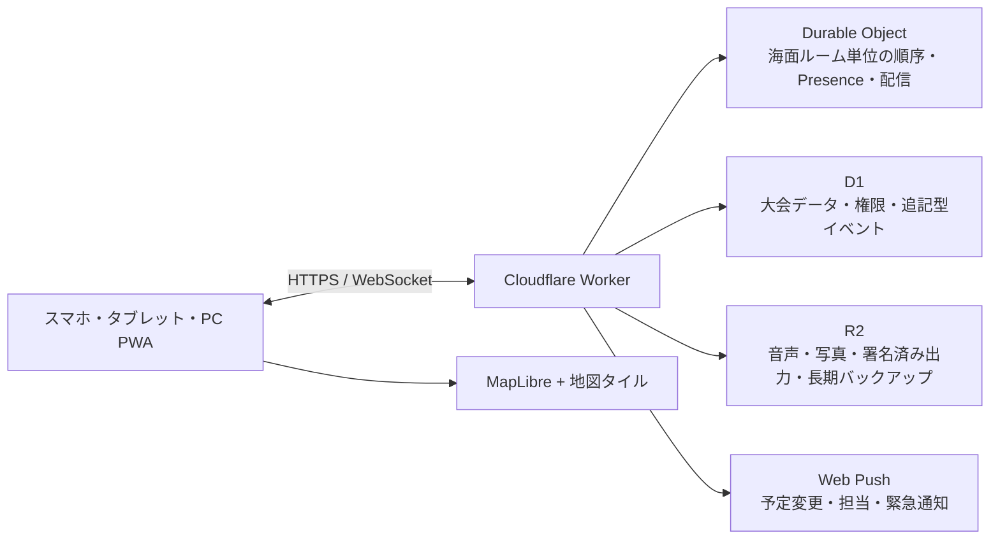

# Sailing Race Supporter 仕様書

Created by Dit-Lab.（Daiki ITO）

- 文書バージョン: 0.3
- 状態: 協議中ドラフト
- 更新日: 2026-07-18
- 想定言語: 日本語を優先、英語対応可能な構造
- 主対象: スマートフォン。タブレット・PCにもレスポンシブ対応

## 1. 目的

本アプリは、セーリングレースのコース設計、マーク設置、風・潮流の観測、運営ボートの位置共有、レース時刻と信号の管理、運営記録を一つのリアルタイム地図上で扱うレース運営支援システムである。

参考サイト「マークレイヤーツール」のコース座標計算を包含し、次を上位機能として提供する。

- トラペゾイド、上下、上下ゲート、トライアングル、スタート／フィニッシュ、カスタムコースへの対応
- 各コース・各回航点での単一マーク／ゲートマーク切替
- 競技ヨットのクラス（艇種）、風速、風向、潮流、海面状態、目標レース時間からの推奨コース長計算
- 常時表示される拡大縮小可能な地図
- 計画地点、実際のマーク投下地点、移動中の運営ボート位置の明確な区別
- マーク単位、運営ボート単位、レース海面単位のリアルタイム共有
- 各マーク・各周回で、先頭の競技ヨットが最初に通過した時刻の記録・共有
- 大会固定URL内での1R、2R等の切替、レース確定、確定後ロック
- 大会、海面、レース、運営ボート、マーク単位のリアルタイムメッセージ
- 地図・時系列・準備状況・未解決事項を統合したレース運用ボード
- 役割と担当範囲に基づく権限管理
- 改ざん検知可能な操作履歴、版管理、ロールバック
- レース予告時刻、リマインド、スタートシーケンス、タイマー
- URLごとに分離されたログとエクスポート
- 保存期間ポリシー、暗号化ローカル／R2バックアップ、検証付き復元
- 参加時の名前・担当登録と、復元用スクリーンショット／コードによる端末喪失対応
- 通信が不安定な海上を前提にしたオフライン継続と再同期

本アプリは海図、航海計器、法定安全設備の代替ではない。地図と位置情報には誤差や欠落があり得るため、安全上の最終判断とレース運営上の決定は権限を持つ人が行う。

## 2. 設計原則

1. **地図中心**: どの主要画面でもコースと現在状況を見失わない。
2. **計画と事実の分離**: 目標地点、投下地点、現在の運営ボート位置を同じ座標として扱わない。
3. **提案と決定の分離**: アプリはコース長や変更を提案するが、公開・変更の決定はRO/PROが承認する。
4. **時刻と出典の明示**: 風、位置、信号、指示には観測時刻、観測者、取得元、精度を付ける。
5. **追記型の記録**: 履歴を上書きせず、訂正や復元も新しい履歴として残す。
6. **海上で使えること**: 大きな操作対象、高コントラスト、片手操作、日光下、濡れた手、低速回線を想定する。
7. **帆走指示書を優先**: 規則プリセットは補助であり、大会のNoR/SIに合わせて変更可能にする。

### 2.1 用語と計測対象

日本語UIと本仕様では、曖昧さを避けるため次の用語を使う。

| 用語 | 意味 |
|---|---|
| 競技ヨット | セーリング競技に参加し、帆走してコースを回る艇 |
| 運営ボート | レース委員会、安全、ジュリー等が使用する、主として動力で航行する公式・支援船舶の総称 |
| マークボート | マークの設置、確認、移動、回収を担当する運営ボート |
| シグナルボート | スタート・フィニッシュ信号や本部機能を担当する運営ボート |
| ピンエンドボート | スタートラインのピンエンド側を担当する運営ボート |
| 安全ボート | 安全監視・救助支援を担当する運営ボート |
| ジュリー／プロテストボート | 水上で審判・観察を行う運営ボート |
| マーク | コースを示すブイその他の物体。ボートとは呼ばない |

RRS英語原文の定義語 `boat` が競技艇を指す引用箇所では、その文脈を明記する。通常の日本語UIで単に「ボート」と表示せず、「競技ヨット」または具体的な運営ボート種別を表示する。

本アプリは、競技中の競技ヨットへのGPS端末搭載を要求せず、そのライブ位置、SOG、COG、船首方位、艇速を収集・表示しない。競技ヨットについて記録するのは、スタート、先頭通過、フィニッシュ等の運営者が観測した時刻・識別情報である。速度・角度・位置をリアルタイム共有する対象は運営ボートである。

## 3. 調査した現行サイトとの差分

現行サイトは、トライアングル、トラペゾイド、LR、LG、スタートについて、風軸、基準点、距離比、内角、ゲート幅からマーク座標を計算する単独利用型のツールである。端末位置の取得と別画面の地図表示はあるが、次は持たない。

- 地図を見ながらの全操作
- 競技ヨットクラス・風速・目標時間からのコース長最適化
- 運営ボートと投下済みマークの同時表示
- 複数人のリアルタイム共同作業
- 役割別権限、招待の失効、監査履歴
- 計画位置と投下位置の差分管理
- オフライン編集と再同期
- レース時刻、信号、リマインド、運営ログ

現行サイトでは位置や設定値をURLクエリに含めて別ページへ渡す実装が見られる。新アプリでは、精密位置を共有URLに埋め込まない。

## 4. 利用者と役割

| 役割 | 主な責務 |
|---|---|
| 大会管理者（大会オーナー） | 大会を作成して固定URLを発行した本人。大会、海面、ユーザー、保存期間、競技ヨットクラスプロファイルを管理し、確定後修正ができる唯一の役割 |
| PRO / RO | コース、時刻、信号、延期・中止・短縮・変更の最終承認 |
| コースセッター | 風・潮流の評価、コース案とマーク目標地点の作成 |
| シグナルボート | スタート／フィニッシュ地点、時刻、信号、音響、先頭通過・フィニッシュ記録 |
| マークボート責任者 | 担当マークボートと担当マークの割当、投下・移動・回収の管理 |
| マークボートメンバー | 自運営ボートの位置共有、担当マークの投下・確認、風・潮流・先頭通過報告 |
| ピンエンドボート | スタートライン端の設置、ライン情報、OCS観測補助 |
| 安全ボート | 安全区域、支援要請、運営ボートの状態、位置共有 |
| ジュリー／プロテストボート | 自運営ボート位置、観測、時刻付きメモ、証拠参照。コース変更権限は持たない |
| 記録員／タイムキーパー | 信号、先頭通過、フィニッシュ、インシデントの記録 |
| 閲覧者 | 許可された海面・艇・ログの閲覧のみ |

権限は役割だけでなく、海面、運営ボート、マーク、レースの範囲で限定できる。例えば「第1マークボートのメンバー」は第1マークの投下と先頭通過を記録できるが、第2マークやコース全体は変更できない。大会管理者は大会作成者一人を原則とし、単なる管理者招待やPRO/ROへの任命では大会オーナー権限を付与しない。

## 5. 基本データ単位

階層は次の通りとする。

`大会（固定共有URL） > レース日 > レース海面 > リアルタイムルーム（内部） > レース > フリート`

- **大会**: 利用者が共有・ブックマークする固定URLの単位。複数日、複数海面、複数レースを含む。
- **リアルタイムルーム**: イベント順序制御と配信を分離する内部単位。例「7月17日 A海面」。利用者に別の共有URLを要求しない。
- **レース**: 第1レース、第2レースなどの運営・ログ単位。
- **コース改訂**: ある時点でROが承認したコース形状と位置の版。
- **マーク目標**: コース計算上の設置予定地点。
- **マーク投下イベント**: 実際にマークを投下・再投下した地点と時刻。
- **運営ボート位置**: 運営ボート上の端末が示す流動的な現在地。

位置座標はWGS 84で保存する。距離は内部的にはメートル、速度はm/s、時刻はUTCで保存し、表示時にm/nm、kt/m/s、ローカル時刻へ変換する。

方位は必ず次を区別する。

- 真方位（True）
- 磁方位（Magnetic）
- 進行方向（COG。GPS移動ベクトル）
- 船首方位（Heading。端末コンパスまたは外部センサー）
- 目標地点への方位（Bearing to target）

磁気偏角の変換にはWMM2025を使用し、モデル版と計算日を記録する。表示の初期値は大会設定で磁方位／真方位を選べる。

初期実装でGPS由来のCOG、目標方位、ゲート方位、風向、流向、C旗の新方位を真方位として扱う箇所は、数値へ必ず `T` を付ける。磁気偏角変換を実装するまでは磁方位と誤認させる無印の方位を表示しない。

## 6. 大会とレース運営のライフサイクル

1. 大会・固定共有URL・海面・対象競技ヨットクラス・参加艇数・NoR/SI設定を登録する。
2. 大会配下に役割・運営ボート・マーク別の招待URLを発行する。
3. 風、潮流、海面状態、目標時間からコース案を作成する。
4. ROがコース案を承認し、各マークボートへ設置タスクを配信する。
5. 各マークボートが目標地点へ移動し、投下地点を記録する。
6. コース準備状況を確認し、予告時刻・スタートシーケンスを実行する。
7. レース中は風の変化、運営ボート位置、マーク状態、各マークの先頭通過、信号、変更指示を共有する。
8. フィニッシュ・マーク回収・運営ボート帰着を記録し、ログを確定・署名・出力する。
9. 先頭通過とフィニッシュの実績時間を競技ヨットクラスプロファイルの校正候補として保存する。

## 7. 地図仕様

### 7.1 常時表示

- スマートフォン縦画面では地図を上部に固定し、操作パネルを下部のボトムシートにする。
- ボトムシートを広げても、地図を画面高の40%以上残す。
- タブレットとPCでは、地図60〜70%、情報パネル30〜40%の分割表示を基本とする。
- 主要操作中に別ページへ遷移させず、地図上またはボトムシートで完結させる。
- ピンチズーム、ダブルタップ、パン、現在地追従、コース全体表示、北固定、進行方向上表示に対応する。

### 7.2 表示レイヤー

| 対象 | 表現 |
|---|---|
| マーク目標地点 | 中抜きのマーク記号、点線のコース |
| 投下済みマーク | 塗りつぶし記号、投下時刻と精度 |
| 旧／移動前マーク | 薄い記号。履歴モード以外では自動的に弱調表示 |
| 運営ボート | 船型または三角矢印。COG方向、SOGに応じたベクトル長 |
| 船首方位 | COG矢印と別色の短い方位線。取得できる場合のみ |
| 担当目標 | 運営ボートから目標への破線、残距離、ETA |
| 自分の担当 | Dodger Blueの太枠と `1マーク（自分）` 等の担当ラベル。マーク、ゲート側、運営ボート、担当区域を強調 |
| 目標と投下地点の差 | 誤差線、距離、方位、風軸方向誤差、横方向誤差 |
| 風 | 観測地点ごとの矢羽、海面平均、振れ幅、鮮度 |
| 潮流 | 流向・流速ベクトル、観測地点、鮮度 |
| スタート／フィニッシュ | 両端点、ライン、長さ、風に対する角度、バイアス |
| ゲート | 2点、中央、幅、風に対する直角誤差 |
| GPS精度 | 選択中の点または艇に精度円 |
| 航跡 | 運営ボートについて運営上必要な期間のみ表示。権限と保存期間を適用 |
| 制限区域 | 陸岸、浅所、航路、立入禁止、スポンサー／撮影区域などの任意ポリゴン |

色だけに依存せず、形、線種、ラベルも併用する。古い位置には「最終更新からの秒数」を表示し、30秒を超えたら明確に「古い位置」と扱う。

### 7.3 自分の担当表示

参加登録と承認済みの担当を、ライブ地図へ常時反映する。本人端末では氏名よりも `（自分）` を優先し、画面上部と地図ラベルを `1マーク（自分）`、`2マーク（自分）`、`プロテスト（自分）`、`マークボートA（自分）` 等の形式で表示する。担当チップをタップすると担当対象へ地図を移動・拡大する。

- 第1マーク、第2マーク等の担当者には、計画地点、投下地点、担当マークボート、目標までの誘導線を強調表示する。
- ゲート担当では、ゲート全体に加えて左／右／両側のどの担当かを明示する。
- マークボート担当では、自運営ボートの記号、担当マーク、次タスク、移動経路を一つの色・記号体系で結ぶ。
- ジュリー／プロテスト担当では、プロテストボート、担当レース海面、観測区域、時刻付きメモのピンを表示する。コースやマークの変更操作は表示しない。
- シグナルボート、ピンエンドボート、安全ボート、コースセッター等も同じ仕組みで担当対象・区域・タスクを表示できる。
- 複数担当がある場合はすべて表示し、現在の主担当を一つ選択できる。主担当の主要ボタンと通知を優先する。
- 同じ対象に複数人がいる場合でも、本人の画面では自分のラベルを先頭にする。他メンバー名は閲覧権限とプライバシー設定がある場合だけ詳細パネルへ表示し、地図を氏名ラベルで混雑させない。
- 担当変更が承認されたらWebSocketで即時反映し、旧担当を「解除済み」として操作不能にする。オフライン中は最終同期時刻を表示する。
- サーバーが担当外、確定後、失効済み権限等の操作を拒否した場合、端末はエラー理由を表示し、オフラインキューから当該操作を除去して大会の権威状態を再取得する。先行表示した投下・タスク・信号等を端末スナップショットへ残さない。
- 自分の担当だけを残して他レイヤーを薄くする「担当フォーカス」を提供する。緊急、安全、スタート信号は薄くしない。
- 地図上の担当表示は権限を示す補助表示であり、それ自体から権限を取得・変更できない。操作時にはサーバーで現在の担当と権限を再検証する。
- 個人ごとのGPS点は新設しない。端末位置を共有する場合も、承認された運営ボートの現在位置として扱い、競技ヨットや個人の追跡に転用しない。

### 7.4 ベースマップ

- MapLibre GL JSを使用し、地図タイル提供元は差し替え可能にする。
- 通常地図に加え、利用条件を確認した上で航路標識等の海洋レイヤーを重ねられるようにする。
- 航海用電子海図としての正確性を保証しない旨を常時確認できるようにする。
- OSM標準タイルはオフライン用の一括取得を認めていないため、オフライン地図が必要な場合は許諾されたプロバイダーまたはセルフホストのベクトルタイルを使用する。
- ベースマップが取得できない場合も、座標グリッド、コース、マーク、運営ボート、風、距離は表示し続ける。

## 8. コース設計

### 8.1 標準テンプレート

初期テンプレートとして次を提供する。

- トラペゾイド・アウターループ
- トラペゾイド・インナーループ
- 風上／風下（1周、2周以上）
- 風上／風下ゲート
- LR / LG相当の風下フィニッシュ／風上フィニッシュ
- トライアングル
- オリンピック型トライアングル＋風上／風下
- スタートラインのみ
- フィニッシュラインのみ
- リーチングスタート／リーチングフィニッシュ
- スラローム
- 固定マークを利用する湾内コース
- カスタムコース

カスタムコースは、マーク、ゲート、ラインをノード、帆走するレグをエッジとするグラフとして編集する。各マークは回航方向、色、形、名称、代替マーク、担当マークボートを設定できる。

### 8.2 コース寸法

- 風軸、基準点、基準レグ長、各レグの距離比、内角、周回数を設定可能にする。
- トラペゾイドのMark 1–2は、World Sailing運営方針の約2/3をプリセットとするが、大会設定で変更できる。
- リーチ角は、スピネーカー使用クラス120°、非スピネーカー使用クラス・ボード110°を初期提案とし、競技ヨットクラスプロファイルまたはSIで上書きできる。
- ゲート幅の初期提案は約10艇身とし、潮流、海面、艇数、SIにより変更できる。
- スタートライン長の初期提案は `参加艇数 × 艇長 × クラス係数` とし、クラス係数を編集可能にする。
- 地理計算にはWGS 84楕円体上の測地線計算を用いる。

### 8.3 コース変更

- 現行コースと変更案を同時に保持する。
- 変更案は「ゴーストマーク」として表示し、担当マークボートにのみ先行共有できる。
- RO承認後に変更案を公開し、C旗、新方位、赤／緑、距離の+／−などの必要信号チェックを表示する。
- 投下前でも次マーク位置の変更指示を作成できる。
- 移動前、移動指示、再投下、確認の全履歴を残す。
- 風向変化が10°、15°、45°の運営目安を超えた場合は通知候補を出すが、自動でコースを変更または中止しない。

### 8.4 コースごとのゲートマーク設定

すべての標準テンプレートとカスタムコースで、回航点ごとに次の形式を選択できる。

- **単一マーク**: 一つのマークを指定方向に回航する。
- **ゲート**: 2個のマークの間をコースサイドから進入し、どちらか一方を選んで回航する。

コース編集画面では、下マーク、上マーク、途中の回航点ごとに「ゲートを使用」トグルを表示する。テンプレートの初期値はクラス・大会プリセットから設定するが、未確定のコース改訂では個別に上書きできる。

ゲートを有効にした回航点は次を持つ。

- ゲートID、左マークID、右マークID、表示名
- 計画中央点、計画方位、計画幅
- 左右それぞれの目標地点、投下地点、GPS精度、担当マークボート
- 実測中央点、実測幅、実測方位、風軸に対する直角誤差
- 通過方向、次レグ、使用開始レース、コース改訂版
- 片側欠損、走錨疑い、代替マーク、単一マーク運用への切替状態

単一マークからゲートへ切り替えると、元の回航点をゲート中央の論理ノードとして保持し、左右の物理マークを子要素として作成する。ゲートから単一マークへ戻す場合も、左右マークの投下・回収履歴を削除しない。

- 地図には左右マーク、ゲートライン、中央点、幅を表示する。
- コース長の予測はゲート中央を基準経路とし、左右選択による距離差を予測幅に加える。
- 先頭通過時刻は「左右どちらかを最初の競技ヨットが正しく通過した時刻」を一つのゲート訪問イベントとして記録し、選択側が判別できれば併記する。
- 左右のマークボートが別の場合でも、ゲートチャンネルで位置、投下、確認、メッセージをまとめて共有する。
- レース進行中の単一／ゲート切替はコース変更案とRO承認を必要とし、信号・SI上の許可を確認する。
- 確定済みレースでは通常権限による変更を禁止し、大会管理者の版付き修正だけを許可する。

## 9. 競技ヨットクラス・風速によるコース長最適化

### 9.1 入力

- 競技ヨットクラス（艇種）または複数クラス
- フリートごとの目標先頭艇時間
- コーステンプレートと周回数
- 5分平均風速、風向、振れ幅、ガスト
- 潮流の流向・流速
- 海面状態（平水、チョップ、うねり、強いうねり）
- 参加艇数
- 使用可能なレース海面境界と安全制限
- 競技ヨットクラスのパフォーマンスプロファイル版
- 必要に応じて気温、視程、日没、安全上限・下限

### 9.2 競技ヨットクラスのパフォーマンスプロファイル

競技ヨットクラスごとに、風速帯と真風向角に対する次の参考値を持つ。

- 風上VMG
- 風下VMG
- リーチ艇速または目的方向への実効速度
- タック・ジャイブ・回航による時間損失
- 軽風・プレーニング・フォイリングへの遷移特性
- 海面状態補正
- 艇長、リグ種別、スピネーカー有無、ボード／スキフ／マルチハル等の分類
- データの出典、承認者、作成日、信頼度、版

World Sailingのクラス規則だけでは風速別の完全なポーラーデータが揃わないため、初期データを絶対値として扱わない。主催者がCSV等で登録でき、実レース結果から校正候補を作る。

校正は自動反映せず、次の流れとする。

1. 各マーク・各周回の先頭競技ヨット通過時刻、フィニッシュ時刻、平均風、コース実長、海面状態を記録する。
2. 予測と実績の差を風速帯・競技ヨットクラス別に算出する。
3. 補正案とサンプル数を提示する。
4. 管理者が新しいプロファイル版として承認する。

このプロファイルはコース設計用のクラス集約モデルであり、競技中の個別ヨットの艇速測定ではない。先頭通過時刻からクラス全体の所要時間モデルを校正しても、個別競技ヨットの区間艇速や航跡は計算・表示しない。

### 9.3 計算モデル

各レグの基準レグ長に対する比を `r_i`、実効進行速度を `V_i`、固定時間損失を `tau`、基準レグ長を `D` とする。

```text
予測先頭艇時間 T(D) = tau + Σ (D × r_i / V_i)

推奨基準レグ長 D* = (目標時間 - tau) / Σ (r_i / V_i)
```

風上・風下レグの `V_i` は艇速ではなくVMGを用いる。リーチは相対風向に対する艇速を目的方向へ投影する。潮流は各レグ方向への成分として補正し、危険な極小値にならない制約を持たせる。

複数クラスが同じコースを使用する場合、各クラスの目標時間に対する相対誤差の加重二乗和が最小となる長さを提案する。同時に各クラスの予測時間を個別表示し、妥協が不適切な場合は別コース、別周回数、短縮候補を提案する。

### 9.4 出力

- 推奨基準レグ長と各レグ長（m/nm）
- マーク・ゲート・ラインの目標座標
- 競技ヨットクラスごとの予測先頭艇時間
- 予測時間の幅と信頼度
- 風速または風向が変わった場合の感度
- スタートライン長、ゲート幅、フィニッシュライン長の提案
- 海面境界・浅所・他海面との干渉警告
- 変更後の推奨距離と変更率

World Sailing運営方針にある「目標時間から20%以上外れる見込み」や「変更後のレグ長50〜150%」は注意喚起プリセットとして提供する。大会ごとに無効化・変更できる。

### 9.5 初期対応競技ヨットクラス

初期リリースでは次の7プロファイルを標準搭載する。利用者の選択肢では「OP、ILCA、420、470、スナイプ」を上位グループとして表示し、ILCAを選ぶとリグを必須選択させる。

| プロファイルID | UI表示 | 乗員 | リグ・艤装上の区分 | 参考目標先頭時間 | 初期コース候補 |
|---|---|---:|---|---:|---|
| `optimist` | OP（Optimist） | 1 | 単一セイル、スピネーカー・トラピーズなし | 50分 | トラペゾイド、風上／風下 |
| `ilca4` | ILCA 4 | 1 | ILCA 4リグ、スピネーカー・トラピーズなし | 50分 | トラペゾイド内／外 |
| `ilca6` | ILCA 6 | 1 | ILCA 6リグ、スピネーカー・トラピーズなし | 50分 | トラペゾイド内／外 |
| `ilca7` | ILCA 7 | 1 | ILCA 7リグ、スピネーカー・トラピーズなし | 50分 | トラペゾイド内／外 |
| `420` | 420 | 2 | メイン、ジブ、スピネーカー、1人用トラピーズ | 45分 | トラペゾイド、風上／風下ゲート |
| `470` | 470 | 2 | メイン、ジブ、スピネーカー、1人用トラピーズ | 50分（参考範囲45〜50分） | トラペゾイド、風上／風下ゲート |
| `snipe` | スナイプ（Snipe） | 2 | メイン、ジブ、スピネーカー・トラピーズなし | 60分（参考範囲60〜75分） | SCIRA O/T/W系、風上／風下 |

参考目標時間は、各クラスの国際大会または運営資料で使われた値を初期入力しやすくするためのプリセットであり、普遍的な規則値ではない。大会のNoR/SIに設定がある場合は必ずそちらを採用し、管理者がレースまたはフリートごとに変更できるようにする。変更時は出典、変更者、適用開始レースを記録する。

- ILCA 4、6、7は同じ船体でも性能が異なるため、別の風速別プロファイル、校正履歴、目標時間を持つ。
- OP、420、470、スナイプもクラスごとに独立したプロファイル版を持つ。
- スナイプは大会種別による風速上限等の差を警告プリセットとして持ち、NoR/SIで確認してから有効化する。
- 数値ポーラー／VMGはクラス規則から推測しない。初期版にはデータ出典と信頼度を必須とし、データ不足の風速帯では「低信頼」と予測幅を表示する。
- 大会実績による校正は各クラス・ILCAリグ・コース形状・風速帯ごとに分離し、異なるプロファイルへ混ぜない。
- 上記以外のクラスも、管理者がカスタムプロファイルとして追加できる。

## 10. 風・潮流・海面情報

### 10.1 風観測

- 観測値: 風向、平均風速、ガスト、最低値、振れ幅、観測時間、観測位置、運営ボート、観測者、機器
- 方位種別: 真方位／磁方位
- 観測方法: 手入力、外部センサー、運営ボート上の計器、API、推定
- 運営ボートの状態: 漂流中、錨泊中、航走中。航走中の値は補正済みかを記録する。
- 1分、3分、5分等の窓を選択でき、5分平均を標準表示する。
- 風向平均は0°/360°を正しく扱う円統計で計算する。
- 海面全体、上マーク付近、下マーク付近等の差を表示する。
- 変化がない報告も「変化なし」として時刻を更新できる。

### 10.2 潮流

- 流向、流速、観測位置、観測時刻、観測方法、信頼度を共有する。
- 漂流測定では開始点・終了点・経過時間を記録し、自動計算する。
- スタートライン、ゲート、各レグへの横流れ・追い流れ成分を表示する。

### 10.3 安全・環境

- 視程、波高・うねり、雷、急変、漂流物、一般船舶、航路干渉を時刻付きで記録する。
- 緊急状態は通常ログと別の高優先度イベントとし、全対象端末へ目立つ通知を出す。
- Flag V等の安全手順を大会設定として登録し、VHFチャンネルと行動チェックを表示できる。

## 11. マーク運用

### 11.1 状態

`計画中 → 承認済み → 担当割当 → 移動中 → 投下済み → 確認済み → 移動指示 → 再投下 → 回収済み`

例外状態として、投下失敗、アンカー走錨疑い、紛失、代替マーク、回収不能を持つ。

### 11.2 投下記録

「マーク投下」は次を一つの不可変イベントとして記録する。

- マークIDとコース改訂版
- 投下時刻（サーバー時刻と端末時刻）
- 投下時点の緯度経度
- GPS精度
- 投下したマークボートと実行者
- 目標地点との差
- 風向・風速・潮流の最新値
- 任意のメモ、写真、アンカー／水深情報

投下時の最新GPS精度をイベントへ固定し、目標地点との差はクライアント申告値を信用せず、サーバーが採用中のコース版の目標座標と投下座標から測地距離として再計算する。GPS精度と計画差は大会・レース別ログおよびバックアップにも残す。

GPS精度の初期表示は、5m以下を良好、5〜15mを注意、15m超を不良とする。しきい値は大会設定で変更できる。不良時は長押し確認と理由入力を要求する。

投下後にマークボートが移動しても投下地点は動かない。地図には投下地点とマークボートの現在地を別々に表示し、必要に応じて両者間の距離と方位を表示する。

### 11.3 マーク位置の検証

- 投下したマークボート以外の運営ボートから「位置確認」を記録できる。
- 複数確認値の差、時間差、GPS精度から走錨疑いを出せる。
- マーク自体にGPSトラッカーがある場合は、運営ボート位置とは別のデータ源として接続する。
- 走錨や移動を断定せず、「投下地点からの観測差」として表示する。

### 11.4 先頭競技ヨットの初回通過時刻

各レースの各マーク訪問について、その訪問で最初の競技ヨットが通過した時刻を記録する。同じマークを複数回使用するコースでは、`マークID + 訪問番号（周回・レグ）` で別の観測対象として扱う。「先頭」は訪問ごとの最初の競技ヨットを意味し、毎回同じ競技ヨットである必要はない。

担当マークボートのライブ画面には、レース開始後、その訪問に対応する大きな「先頭通過」ボタンを表示する。押下時に次を不可変イベントとして記録する。

- 大会、レース、フリート、コース改訂版
- マークID、訪問番号、周回、直前レグ
- 観測時刻、スタートからの経過時間、直前の先頭通過からのスプリット
- 観測者、観測した運営ボート、端末ID
- サーバー時計との差、同期品質、GPS精度、オフライン状態
- 任意のセール番号／バウ番号、メモ、写真、音声

競技ヨットへのトラッカー搭載や艇速計測は行わず、担当者の目視タップを第一の記録方法とする。通信断中も端末の単調増加時計と直近のサーバー時計オフセットで記録し、再接続時に観測時刻と送信時刻を分けて同期する。

- 複数の観測者が押した場合も全記録を保持し、指定記録員が採用記録を確定する。
- 観測差が大会設定値（初期値2秒）を超えた場合は警告し、自動平均や上書きをしない。
- 押し間違いは削除せず、「取消」または「訂正」イベントを追記する。
- 記録後ただちにPRO/RO、タイムキーパー、次のマークボートへ共有する。
- ライブ目標時間予測とクラスプロファイル校正には使用できるが、個別競技ヨットの区間艇速は算出・表示しない。
- レース確定時に採用記録を固定し、通常権限では変更・削除・再採用できない。大会管理者が修正する場合も元記録を保持し、新しい確定版としてのみ追加できる。

### 11.5 先頭競技ヨットのフィニッシュ時刻

シグナルボート、タイムキーパー、記録員、PRO/ROは、最初の競技ヨットがフィニッシュした瞬間を大きなボタンで記録できる。マーク通過と同様に、観測時刻と本部が採用した時刻を分離する。

- 観測時刻、受信時刻、サーバー時計との差、同期品質、オフライン状態、観測者、運営ボート、端末IDを保存する。
- セール番号／バウ番号と判定メモは任意とし、時刻ボタンを押す前の必須入力にはしない。
- 複数端末の候補をすべて保持し、差が初期値2秒を超えた場合は自動平均せず警告する。
- PRO/RO、タイムキーパー、記録員、シグナルボートまたは大会管理者が一つの候補を採用する。再採用は元候補と旧採用版を残した追記訂正とする。
- 通信断中も最後に同期した時計差を使って端末内へ記録し、復帰後に観測時刻を変更せず同期する。
- レース確定時は全候補、採用版、信号、マーク、先頭通過とともに固定スナップショットへ含める。確定後に追記訂正できるのは大会URL発行者だけとする。
- 本機能は競技ヨットの位置、航跡、艇速を計測せず、運営者が目視したフィニッシュ時刻だけを扱う。

## 12. 運営ボートの速度・角度・位置

各運営ボートについて次をリアルタイム表示する。

- 現在位置、水平精度、最終更新時刻
- 対地速力 SOG（kt）
- 進行方向 COG（真／磁）
- 船首方位 Heading（取得可能な場合）
- 目標地点までの距離と方位
- COGと目標方位の差（右／左何度）
- 目標方向への接近速度
- 到着予想時間 ETA
- 目標経路からの横ずれ XTE
- 担当タスクと状態
- 端末の通信状態と、取得可能ならバッテリー状態

Web Geolocationのspeedまたはheadingが取得できない場合、連続する有効なGPS位置からSOG/COGを推定する。低速・停止中はCOGが不安定になるため、初期しきい値0.5kt未満では方向を「—」とし、最後の有効値と混同しない。

GPSのheadingは船首方位ではなく移動方向である。端末コンパスによる船首方位は、端末を運営ボートの前後軸に合わせた校正操作をした場合だけ表示し、精度不明の場合は「参考」と明記する。将来はNMEA 0183/2000、Bluetooth GPS、AIS等の外部センサー入力を追加可能にする。

位置送信頻度の初期値は、移動中2秒、停止中10秒とし、通信・電池・速度に応じて適応させる。位置更新はリアルタイム配信用と保存用を分離し、D1には間引いた位置または重要イベントのみ保存する。

## 13. リアルタイム共有

### 13.1 共有範囲

- 大会全体
- 特定のレース海面
- 特定のレース（1R、2R等）
- 特定の運営ボートとそのメンバー
- 特定のマークまたはゲート
- 風・潮流観測のみ
- ログ閲覧のみ

クライアントは接続時に現在のスナップショットと最終連番を受け取り、その後は順序付きイベントをWebSocketで受信する。再接続時は不足イベントを再取得する。

### 13.2 競合と再送

- 各操作に一意なidempotency keyを付け、電波断による二重投下記録を防ぐ。
- コース編集は基準版番号を送り、古い版への編集は自動上書きしない。
- 投下、信号、緊急報告等はオフラインキューに保存し、再接続後にサーバー時刻と端末時刻の両方を保持して同期する。
- RO承認済みコースに対する変更は、権限があっても変更案として作成し、承認操作を分離する。

### 13.3 鮮度

- 位置、風、潮流、タスクに最終更新時刻を表示する。
- 標準で5秒以内をライブ、5〜30秒を遅延、30秒超を古い情報とする。
- 接続断中は、地図上のアイコンを消さず、古いことを明示する。

### 13.4 運営メッセージ

大会固定URLの中で、運営メンバー同士が短いメッセージをリアルタイムに交換できる。チャンネルは権限に応じて自動参加させる。

- 大会全体
- レース海面
- 1R、2R等のレース
- 特定の運営ボートとそのメンバー
- 特定のマークまたはゲート
- PRO/RO、マークボート、安全ボート等の役割グループ
- 1対1の運営連絡

メッセージには本文、送信者、送信時刻、対象レース、優先度、返信元、編集状態を持たせ、次を添付できる。

- マーク、ゲート、運営ボート、コース改訂版への参照
- 地図上の一時ピンと緯度経度
- 風・潮流・安全報告への参照
- 写真、短い音声、定型報告

優先度は「通常」「要確認」「緊急」とする。「要確認」「緊急」は対象者ごとの配信済み、既読、確認済みを表示し、未確認者へ再通知できる。緊急メッセージは通常チャットに埋もれない固定バナーと音・振動で通知する。

- VHF等の公式・安全通信を置き換えるものではなく、使用チャンネルと通信手順を大会設定に併記する。
- 海上操作を妨げないよう、定型文、音声入力、ワンタップ返信（了解／対応中／完了／再送願う）を提供する。
- オフライン送信はキューに保存し、「未送信」を明示する。緊急通信は未送信なら画面上で代替手段を促す。
- 送信済み本文を無痕跡で編集・削除できない。訂正は元メッセージを残した訂正メッセージとして追記する。
- レース確定時点までのレースチャンネルは確定スナップショットに含める。確定後も大会管理者は運営連絡を追記できるが、確定前メッセージの原文は変更しない。
- チャンネルごとに通知、メンション、ミュート、保存期間を設定できる。ただし緊急チャンネルは完全ミュート不可とする。

## 14. 大会URL、招待と権限

### 14.1 大会固定URL

大会ごとに、開催期間を通して変わらない正規URLを一つ発行する。

```text
https://app.example.jp/e/{event-id-or-slug}
```

- 大会URLは、複数日、複数海面、1R、2R以降の全レースへ移動する入口とする。
- レース切替後も大会URL自体は変えず、選択中のレースは画面状態または配下ルートで表現する。
- 深いリンクは `/e/{event-id}/areas/{area-id}/races/{race-id}` とし、アクセス権確認後に同じ大会画面内の対象レースを開く。
- 大会の公開識別子またはslugは秘密情報ではない。閲覧権限は招待、ログイン、認証セッションで判定する。
- 大会を新規作成してこのURLを発行した認証済みユーザーを、その大会の唯一の「大会管理者（大会オーナー）」として記録する。
- 任意で、正確な位置を含まない読取専用の大会ホーム（予定、レース状態、公式文書リンク）を公開できる。
- ログ、地図、設定、メンバー、運営ボート、マークはすべて大会URLを起点に移動・絞り込みできる。
- リアルタイム配信は日・海面等で内部ルームに分割できるが、利用者に新しい共有URLへの参加を要求しない。

### 14.2 招待URL

招待リンクは、役割、対象海面、艇、マーク、期限、使用回数を持つ。

例:

```text
https://app.example.jp/e/{event-id}/join/{invite-id}#token={secret}
```

秘密値はURLフラグメントに置き、最初のHTTPリクエスト、アクセスログ、Refererに送らない。アプリが秘密値を一度だけ交換し、HttpOnly・Secure・SameSite付きセッションCookieを発行した後、ブラウザ履歴を大会固定URLへ置換して秘密値を除去する。

- 秘密値は十分な乱数で生成し、サーバーにはハッシュのみ保存する。
- 読取専用、1回限り、複数人用、期限付き、無期限を選べる。
- いつでも失効・再発行できる。
- 重要権限はリンクだけで恒久付与せず、表示名の登録と任意のパスキー認証を要求できる。
- 緯度経度、権限、内部IDを共有URLに直接含めない。

### 14.3 権限の初期方針

| 操作 | 管理者 | PRO/RO | コースセッター | 担当マークボート | シグナルボート | ジュリー／プロテスト | 閲覧者 |
|---|---:|---:|---:|---:|---:|---:|---:|
| 大会設定 | 可 | 一部 | 不可 | 不可 | 不可 | 不可 | 不可 |
| コース案作成 | 可 | 可 | 可 | 不可 | 不可 | 不可 | 不可 |
| コース公開・変更承認 | 可 | 可 | 不可 | 不可 | 不可 | 不可 | 不可 |
| 担当マーク投下 | 可 | 可 | 可 | 可 | 不可 | 不可 | 不可 |
| 自運営ボート位置共有 | 可 | 可 | 可 | 可 | 可 | 可 | 任意 |
| 風・潮流報告 | 可 | 可 | 可 | 可 | 可 | 可 | 不可 |
| 担当マークの先頭通過記録 | 可 | 可 | 可 | 可 | 可 | 可 | 不可 |
| 許可チャンネルへのメッセージ送信 | 可 | 可 | 可 | 可 | 可 | 可 | 不可 |
| 信号・タイマー確定 | 可 | 可 | 不可 | 不可 | 可 | 不可 | 不可 |
| レース確定 | 可 | 可 | 不可 | 不可 | 不可 | 不可 | 不可 |
| 確定後修正版の作成 | 可 | 不可 | 不可 | 不可 | 不可 | 不可 | 不可 |
| ロールバック提案 | 可 | 可 | 可 | 不可 | 不可 | 不可 | 不可 |
| ロールバック承認 | 可 | 可 | 不可 | 不可 | 不可 | 不可 | 不可 |
| ログ閲覧 | 可 | 可 | 可 | 担当範囲 | 可 | 許可範囲 | 許可範囲 |

大会ごとに変更できるが、権限拡大は管理者またはPROの監査対象操作とする。

### 14.4 大会参加時の名前・担当登録

招待URLを開いた利用者は、位置・メッセージ共有を開始する前に次を入力する。

- 表示名（必須）
- よみがな（任意）
- 所属／チーム名（任意）
- 担当役割（必須。招待で許可された候補から選択）
- 担当運営ボート、担当マーク、担当海面（該当する場合）
- 当日の連絡用メモ（任意。電話番号等の機微情報を安易に要求しない）

名前と担当の入力は権限付与そのものではない。招待URLに担当が固定されていればその範囲だけを選択でき、自由参加リンクから選んだ担当は大会管理者またはPRO/ROの承認待ちにする。利用者が「大会管理者」「PRO/RO」等を入力するだけで権限を取得できないようにする。

- 同名参加者を許容し、内部では推測困難な `member_id` で識別する。
- 共有端末では「乗員を追加」できるが、操作ログには実際の操作者を選択またはPINで切り替えて残す。
- 担当変更は変更前後、申請者、承認者、適用時刻を追記する。
- 参加完了前に位置共有、通知、音、画面スリープ防止の権限診断を行う。

### 14.5 参加情報の喪失時復元

参加登録が完了したら、端末上で128bit以上の乱数を使った復元秘密を生成し、次を含む「参加復元カード」を一度表示する。

- 大会名と大会URL
- 表示名
- 担当役割、運営ボート、マーク、海面
- メンバーID
- 復元用QRコードと手入力コード
- 発行日時と注意事項

画面には大きく「この画面をスクリーンショットして、安全な場所に保存してください」と表示し、「スクリーンショットを保存しました」確認を参加完了の一段階にする。WebアプリからOSのスクリーンショット実行を強制・検出できないため、同時に画像保存、PDF保存、印刷も提供する。

- 復元秘密そのものはサーバーへ平文保存せず、検証用ハッシュだけを保存する。
- QRコードには大会ID、メンバーID、復元秘密を含めるが、正確な位置、招待秘密、他人の情報は含めない。
- スクリーンショットを第三者へ送らないこと、クラウド写真同期の共有範囲を確認することを明記する。
- 端末喪失時は大会固定URLの「参加情報を復元」から、QR画像読取りまたは手入力コードで名前、担当、権限スコープを新端末へ復元する。
- 復元時はQR内の表示情報を信用せず、サーバー上の現在のメンバー状態と担当を取得する。参加取消・担当解除・期限切れの場合は復元を拒否する。
- 復元成功後は旧認証セッションと旧復元コードを失効し、新しい復元コードを発行して再度スクリーンショットを促す。
- 復元、失敗、コード再発行、全端末失効を監査ログへ残し、連続失敗にはレート制限を適用する。
- 大会管理者、PRO/RO、確定後修正権限等の重要権限は復元カードだけで復元せず、パスキーまたは大会管理者の再承認を追加で要求する。
- 大会管理者の所有権復旧は参加者復元とは分離し、復元カードから大会オーナー権限を取得できない。

## 15. レース予定、リマインド、タイマー、信号

### 15.1 予定

- レース番号、フリート、予告信号予定時刻、目標スタート時刻、目標時間、タイムリミットを登録する。
- 大会内に1R、2R、3R等を作成し、海面・フリートごとに選択中のレースをワンタップで切り替えられる。
- レース切替時は、レース番号、状態、クラス、スタート時刻、コース版を固定ヘッダーに表示し、別レースへの誤記録を防ぐ。
- レースタブは非選択中でも、開始までの同期カウントダウン、HOLD、競技中、暫定、確定、未確認の緊急連絡を表示する。1秒更新は地図から分離し、タブ切替後も進行中レースを見失わせない。
- 進行中のレースがある状態で別レースへ切り替えても、タイマーとリアルタイム処理はバックグラウンドで継続する。
- 同一海面で原則一つのレースを「進行中」にする。複数フリートを同時進行できる設定では、フリート別に明示する。
- 「最早予告時刻」「予定予告時刻」「次の予告まで」を区別する。
- 延期、ゼネラルリコール、再スタート、短縮、中止、次レースへの切替を状態として扱う。
- 予定変更は対象者へプッシュ通知し、既読／未読を確認できる。
- 予告予定時刻の手動変更は大会管理者、PRO、ROに限定し、開始手順に入った後は先に延期、ゼネラルリコールまたは中止を記録して準備中へ戻す。確定済みレースは通常の予定変更を受け付けない。
- 変更時は変更前後の予告時刻、理由、変更者、変更源、変更時刻を `race_schedule_events` へ追記し、未完了の相対時刻タスクだけを時刻差分で再計算する。完了済みタスクの実績時刻は変更しない。
- 標準運用タスクとして、予告30分前の全体準備、15分前の担当別最終確認、5分前のスタート要員確認を持つ。延期中は時刻通知を停止し、次の予告確定後に新時刻から再計算する。
- 運用ボードのタスクは「状態変更」「対象マークを地図で開く」「担当者へ連絡」を別操作にし、対象確認だけでタスク状態を変えない。担当・期限・ブロッカー状態から地図またはレース宛てメッセージ作成へ直接移動できる。

### 15.2 スタートシーケンス

標準プリセットとしてRRS 26の5・4・1・0分シーケンスを持つ。

- 5分: クラス旗、予告信号
- 4分: P/I/Z/Z+I/U/黒旗等、準備信号
- 1分: 準備旗降下、長音
- 0分: クラス旗降下、スタート

NoR/SIで変更された数値式スタート、メダルレース、リーチングスタート等をテンプレートとして追加できる。時間は視覚信号を基準に記録し、音響信号は別項目として記録する。

- サーバー時刻とのずれを測定し、全端末で同じカウントダウンを表示する。
- 通信断後も端末の単調増加時計で継続し、再接続時に補正する。
- 音、読み上げ、振動、全画面色変化を個別設定できる。
- 誤操作防止のため、開始・延期・リコール・中止は大きなボタンと確認動作を使う。

#### 15.2.1 同期音響信号

標準プリセットでは、視覚信号に合わせて次の音を予約・再生する。

| 残り時間 | 視覚信号 | 標準音 | アプリの状態イベント |
|---:|---|---|---|
| 5分 | クラス旗掲揚（予告） | 1声 | `warning` |
| 4分 | 準備旗掲揚 | 1声 | `preparatory` |
| 1分 | 準備旗降下 | 長音1声 | `one_minute` |
| 0分 | クラス旗降下 | 1声 | `start` |

RRS上は視覚信号の時刻が基準であるため、アプリは「予定時刻」「視覚信号の実行時刻」「音の実行時刻」を別々に記録する。音が鳴らなかった場合も、視覚信号の記録を自動で変更しない。

- 公式音を鳴らす端末は、本部船として指定されたシグナルボートの「公式音響端末」1台だけにする。
- 他端末の音・振動・読み上げは「参考通知」と表示し、公式音と誤認させない。
- 公式音響端末は開始前に音量、消音状態、音源、外部スピーカー、端末時刻差をテストし、「音響準備完了」にする。
- ブラウザの自動再生制限に対応するため、担当者の操作で音響機能を事前に有効化し、音源をPWAへローカル保存する。
- 予約音は `setInterval` の積算ではなく、確定した信号時刻と端末の単調増加時計から毎回算出し、画面描画の遅延に引きずられないようにする。
- 公式端末は通信断中もシーケンスと音を継続し、復帰後に実行時刻を同期する。追従端末はサーバーの権威時刻から表示を補正する。
- NoR/SIで音響パターンが変更される大会では、プリセットを版管理して上書きできる。

#### 15.2.2 本部船による延期

本部船（シグナルボート）のPRO/ROが延期を決定した場合、その端末で「延期」を実行し、AP旗の視覚信号を行った実時刻を記録する。

- 延期イベントを受けた時点で、そのレースの未実行の予告・準備・1分・スタート音をすべて取消し、カウントダウンを「延期中」に切り替える。
- 延期は予告前・スタートシーケンス中のどちらでも実行できる。シーケンス中の延期では、予定スタートを無効化し、途中時点から再開しない。
- すでに鳴り始めた音は取り消せないため、実行済み音として時刻を残し、延期イベントとの前後関係を監査できるようにする。
- 延期状態、AP掲揚時刻、理由、決定者、新しい予定が大会・海面・該当レースの全端末とメッセージチャンネルへ即時配信される。
- AP降下時刻を記録し、RRS標準プリセットでは、その1分後を次の予告信号候補とする。ただし自動的に公式シーケンスを再開せず、PRO/ROが新しい予告時刻を確認して「再開準備完了」にする。
- AP over H、AP over A、追加延期、または中止へ移行できる。いずれも元の予定とイベントを削除せず、新しい状態として追記する。
- 通信断時は本部船の公式音響端末で延期を最優先に処理し、未実行音をローカルで停止する。再接続後、他端末へ実時刻を配信する。
- 追従端末からの延期提案はPRO/ROへの要確認メッセージに留め、公式シーケンスを停止する権限は持たせない。

#### 15.2.3 コース変更・欠損マーク・捜索救助信号

RRS 2025–2028の規則33、34、37に対応し、スタート後の運営判断をURL参加者へ即時共有する。

- **C旗（次のレグを変更）**: 変更後のレグを開始する回航点、位置を変更する次マーク、新しいコンパス方位（3桁）、緑三角／赤長方形による左右変更、`+`／`−`による距離変更を記録する。C旗と反復音を全競技ヨットが次のレグを開始する前に行い、実行権限は大会管理者またはPRO/ROに限定する。
- **M旗（欠損・位置ずれしたマークの代替）**: 対象マークと、M旗を掲げて反復音を行う代替物または運営ボートを記録する。対象レースが進行中の場合だけ実行できる。
- **V旗（捜索救助通信）**: V旗と1声を記録し、競技ヨット、公式艇、支援艇が聴取するレース委員会通信チャンネルと捜索救助指示を共有する。
- C旗とM旗は進行中レースでのみ実行でき、対象マークは採用中の最新コース版に存在するものをサーバーで検証する。
- 信号名、旗、標準音、対象マーク名はクライアント入力を信用せずサーバーで確定する。判断理由、予定時刻、視覚信号の実行時刻、音響の実行時刻、公式音響端末、実行者を追記型監査ログへ保存する。
- 「反復音」は一度のタップで終了したものと誤解させず、アプリの1サイクル再生後も全競技ヨットが当該レグを開始するまで現場で反復する旨を表示する。

### 15.3 運営リマインド

- 「予告20分前までにMark 1確認」
- 「5分平均風を更新」
- 「スタート90秒前から録音開始」
- 「最終レグ開始前にフィニッシュライン準備」
- 「バッテリー／通信／GPS精度確認」
- 「レース後に全マーク回収・全艇帰着確認」

リマインドは大会テンプレート、役割、レース状態、絶対時刻、相対時刻から作成する。

初期実装では予告予定をリマインドの基準時刻とし、手動変更、AP降下、第一代表旗降下、N旗降下のいずれも同一の再計算処理を使う。新しい期限は大会ルームへ即時配信し、運用ボードと大会・レース別ログへ反映する。

端末内の「運営モード」は、アプリ／PWAを開いている間、予告20分前、10分前、5分前、1分前、予定時刻に参考通知を一度ずつ表示し、対応端末では振動とScreen Wake Lockによる画面維持を行う。バックグラウンド復帰で複数の期限を過ぎていた場合は最新の1件だけを通知して通知集中を避ける。通知許可を拒否した端末でも画面維持を単独で利用でき、非対応・拒否・画面維持待ちをスタートシーケンスに表示する。AP、第一代表旗、N旗等でシーケンスを保留した間は旧予定の端末通知を止め、再開後の新しい予告時刻を別スケジュールとして重複防止する。これは公式音響ではなく、アプリを閉じた状態にも配信するWeb PushはDurable Object Alarm／Cron Trigger導入段階で追加する。

### 15.4 レース状態と確定ロック

レースは次の状態を持つ。

`下書き → 準備中 → 進行中 → 暫定完了 → 確定済み（通常ロック）`

- 切替タブには、1R等の番号と状態を常時表示する。
- 「確定」はPRO/ROまたは大会管理者だけが実行できる。
- 確定前に、スタート時刻、採用コース版、先頭通過、フィニッシュ、信号、未同期端末、未解決の競合をチェックリストで確認する。
- 確定操作では対象レース名と件数を示し、再認証と「1Rを確定」の明示入力を要求する。
- 確定時にレースの全確定イベント、採用値、コース版、権限スコープから固定スナップショットとハッシュを作成する。
- 確定後は、PRO/ROを含む大会管理者以外の全員が編集、削除、差し替え、再オープン、ロールバックできない。APIとDBアクセス層でも拒否する。
- 大会URLを発行した大会管理者だけが「管理者修正モード」を開始できる。開始には再認証、修正理由、対象項目の選択を必須とする。
- 管理者修正でも元の確定版を直接更新・削除しない。元版を固定したまま修正版を新しい版（例: 確定版v2）として作り、差分、理由、管理者、時刻を表示する。
- 修正版を公開するには大会管理者が再確定する。再確定までは「管理者修正中」と明示し、一般利用者には最後に確定した版を表示する。
- 修正履歴はすべて閲覧・エクスポートでき、以前の確定版を隠さない。修正版の誤りには、さらに新しい修正版を作る。
- 他のレースは独立して編集・進行・確定できる。1Rの確定は2Rの作成・運営を妨げない。

## 16. ログ、改ざん検知、ロールバック

### 16.1 ログ対象

- ログイン、招待使用、権限変更
- コース案、承認、変更、復元
- マーク割当、投下、確認、移動、回収
- 風、潮流、海面、安全報告
- 予告、準備、1分、スタート、予約音、実行音、取消音、延期、AP降下、再開、リコール、短縮、中止、フィニッシュ
- 各マーク・各訪問の先頭競技ヨット通過、採用、取消、訂正
- レース切替、暫定完了、確定、管理者修正版の作成・再確定
- メッセージ送信、訂正、配信、確認、緊急通知
- OCS候補、インシデント、VHF連絡メモ
- オフライン操作の送信時刻と実行時刻
- エクスポート、署名、削除／匿名化要求

各イベントは `event_id` と内部 `room_id` の下で連番を持ち、必ず `race_id` を付ける。操作者、役割、サーバー時刻、端末時刻、端末ID、イベント種別、内容、直前ハッシュ、自己ハッシュを保存する。大会URLからレースを切り替えると、該当 `race_id` のログだけを即座に表示できる。

### 16.2 改ざん防止の意味

完全な「改ざん不可能」ではなく、次を満たす改ざん検知可能な設計とする。

- クライアントはDBを直接更新せず、権限を検証したサーバーだけがイベントを確定する。
- 追記型イベントをハッシュチェーンにする。
- イベント確定時、レース確定時、大会終了時にチェックポイントを作る。
- エクスポートにハッシュ一覧とサーバー署名を付け、後から検証できる。
- 訂正、取消、復元も元イベントを消さず、新イベントとして残す。
- Cloudflareのアカウント監査ログとD1 Time Travelを運用上の補助にする。

### 16.3 ロールバック

アプリ上のロールバックは、DB全体を過去へ戻す操作ではない。

ロールバックは未確定レースにだけ許可する。確定済みレースは対象にできない。

1. 復元対象の未確定レースのコース版または状態を選ぶ。
2. 現在状態との差分を表示する。
3. ROまたは管理者が理由を入力して承認する。
4. 過去版を基に新しい版を作り、「復元イベント」を追記する。
5. 接続端末へ新しい版として配信する。

D1 Time Travelは誤ったDB操作や障害時の管理者向け災害復旧に限定する。レース中の通常操作には使わない。

### 16.4 出力

- タイムライン表示
- CSV（観測、位置、信号、マーク、操作）
- JSON（完全イベントと検証情報）
- PDF（大会提出・振り返り用レポート）
- GPX/KML（許可された運営ボート・マーク航跡）
- 音声、写真等の添付一覧

### 16.5 データ保存期間

大会作成時に保存期間テンプレートを選択し、対象大会のNoR/SI、主催団体の規程、個人情報方針に合わせて大会管理者が変更できる。初期推奨値は次の通りとする。

| データ区分 | 初期保存期間 | 期間終了時の処理 |
|---|---:|---|
| レース確定版、管理者修正版、コース版、信号、マーク投下、先頭通過、フィニッシュ、監査ハッシュ | 大会終了後5年 | ローカルバックアップ確認後、管理者の明示承認で削除可能 |
| 風・潮流・海面観測、マーク位置検証 | 大会終了後1年 | 集約値を残し、詳細を削除可能 |
| 運営ボートの高頻度ローカル航跡 | 7日 | 自動削除。重要イベント地点は対象外 |
| D1に間引いて保存した運営ボート位置 | 90日 | 日・レース単位に集約後、個別点を削除 |
| 通常メッセージ | 90日 | 本文を削除し、送信時刻・送信者・内容ハッシュの墓標を保持 |
| 要確認・緊急・公式判断に使われたメッセージ | 大会終了後5年 | 監査記録として確定版に含める |
| 写真・音声添付 | 90日 | 添付本体を削除し、ファイルハッシュと参照イベントを保持 |
| 参加者の名前・担当・所属 | 大会終了後1年 | 統計に不要な識別情報を匿名化 |
| 招待、認証セッション、復元コード | 大会終了後30日 | 失効後に秘密・ハッシュを削除。使用履歴は監査期間に従う |
| 認証・権限変更・復元失敗等のセキュリティログ | 1年 | 集計後に個別端末情報を削除 |
| エクスポート／バックアップの作成・復元履歴 | 大会終了後5年 | ファイル本体ではなくメタデータとハッシュを保持 |

- 保存期間はデータ作成日ではなく、原則として大会終了日時から計算する。大会終了未設定の場合は自動削除を開始しない。
- 期間短縮は、削除対象件数、復元不能になる内容、最終バックアップ日時を表示し、大会管理者の再認証を要求する。
- 削除予定を30日前、7日前、1日前に大会管理者へ通知し、ワンクリックでローカルバックアップを作成できるようにする。
- 抗議、審問、事故調査、法的要請等が継続中のデータには保存ホールドを設定し、解除されるまで削除しない。
- ハッシュチェーン対象を削除する場合は、元内容のハッシュ、削除区分、削除日時、根拠、実行者を示す墓標イベントを残し、削除を隠さない。
- R2のLifecycle Rulesと日次の1本のCron処理で削除候補を管理し、Cloudflare無料枠のCron数と操作数を抑える。
- 保存期間と実削除日時は大会ごとのデータ台帳で確認・CSV出力できる。

### 16.6 ローカルバックアップ

大会管理者は大会URLから、ブラウザのダウンロード機能を使って大会データを一つの `.srs-backup` ファイルとしてローカル保存できる。File System Access APIが利用可能な端末では保存先を選択し、iOS等では通常のファイルダウンロードと共有シートを使用する。

バックアップには次を含める。

- 大会、日、海面、レース、フリート、クラス、コース、ゲート、マーク、運営ボートの設定
- 権限スコープとメンバー情報
- 追記型イベント、確定版、管理者修正版、メッセージ、観測、間引いた位置
- 添付ファイル一覧と内容ハッシュ。添付本体を含めるかは選択可能
- スキーマ版、アプリ版、作成日時、対象範囲、イベント件数
- 各ファイルのSHA-256、イベントハッシュチェーン、サーバー署名を含むマニフェスト

- 名前、位置、メッセージを含むため、バックアップはパスフレーズから導出した鍵によるAES-GCM暗号化を初期値とする。
- パスフレーズと復号鍵はサーバーへ送らず、忘れた場合は復元できないことを保存前に明示する。
- 復元コード、招待秘密、認証Cookie、パスキー秘密鍵、Worker Secretはバックアップへ含めない。
- 「設定のみ」「レース記録を含む」「完全（添付本体を含む）」の3種類を提供し、予想ファイルサイズを表示する。
- 1R等のレース確定時、各レース日終了時、大会終了時、削除予定前にバックアップを促す。ブラウザの制約上、利用者の許可なしにローカルへ自動保存したと誤認させない。
- バックアップ完了後にファイル名、サイズ、ハッシュ、対象最終連番を表示し、D1にはバックアップ本体ではなく作成記録だけを残す。

### 16.7 バックアップからの復元

復元は次の2モードを持つ。

1. **ローカル検証表示**: サーバーを書き換えず、バックアップをブラウザ内で復号・検証し、地図、レース、ログを読取専用で表示する。
2. **大会への復元**: 大会管理者だけが、検証済みバックアップから新しい復元版をサーバーへ作成する。

大会への復元手順は次の通りとする。

1. ファイルを端末内で復号し、形式、スキーマ版、署名、全ハッシュ、イベント連番を検証する。
2. 対象大会IDと現在の大会を照合する。別大会への取込みは「大会複製」として扱い、同一大会の履歴に混ぜない。
3. 現在状態との差分、追加・競合・欠落件数、確定済みレースへの影響を表示する。
4. 大会管理者が再認証し、復元理由と対象範囲を入力する。
5. 元データを直接上書きせず、新しい「バックアップ復元版」と復元イベントを追記する。
6. 確定済みレースに差分がある場合は、管理者修正版として再確定するまで最後の確定版を一般表示する。

- 署名不正、ハッシュ不一致、欠落、未知の新しいスキーマは自動適用せず、読取専用の診断結果を表示する。
- 古いスキーマは段階的な移行コピーを作り、元バックアップファイルを変更しない。
- D1 Time Travelによる災害復旧とローカルバックアップ復元を混同せず、実行者と手順を別ログにする。
- 復元後に件数、最終連番、ハッシュルートを再検証し、復元レポートをダウンロードできる。
- リリースごとに固定テストデータで「バックアップ作成→新環境復元→ハッシュ一致」の自動試験を行う。

## 17. オフラインと不安定回線

- PWAとしてインストール可能にする。
- アプリ本体、最後のコース、担当タスク、地図スタイル、許可された地図キャッシュを保持する。
- IndexedDBに未送信操作とローカルログを保存する。
- 通信断中もGPS、距離、方位、SOG/COG、マーク投下、タイマーを利用できる。
- 通信断中も先頭通過時刻を端末の単調増加時計で記録できる。
- オフライン中の共有相手位置は更新せず、必ず鮮度を表示する。
- 再接続時は操作を順序・重複・基準版を検証して送信する。
- ブラウザがバックグラウンド位置取得を停止する可能性を前提とし、位置共有中は画面を開いた状態を推奨する。信頼性が必要な大会には外部GPS／専用トラッカー連携を用意する。

## 18. 画面構成

### 18.1 主要画面

1. 大会一覧／大会ホーム
2. 大会参加（名前・担当）／参加情報復元
3. ライブ海面地図
4. コース設計・最適化
5. 自運営ボート・担当マーク操作
6. 風・潮流報告
7. 運営メッセージ
8. レース予定・スタートコンソール
9. ログ・リプレイ
10. メンバー・運営ボート・権限・招待
11. 競技ヨットクラスプロファイル管理
12. 保存期間・バックアップ・復元
13. 大会設定

スマートフォンでは「ライブ海面地図」がホーム画面となる。ログや設定を開いても、ミニマップまたは地図領域を残す。ただし長文の管理画面とPDFプレビューは常時地図要件の例外にできる。

### 18.2 スマートフォンのライブ画面

- 上: 常時地図
- 地図上部: 1R／2R等のレース切替、選択レースの状態、次の予告まで、接続状態
- 地図上部: 自分の主担当チップと担当変更の最終同期時刻
- 地図右側: 現在地追従、全体表示、北固定、レイヤー
- 下部ボトムシートの要約: 自運営ボートSOG/COG、担当目標までの距離・方位・ETA
- ボトムシートのタブ: タスク、風、メッセージ、タイマー、ログ。未読数と緊急状態を表示
- 最下部の主要ボタン: 「投下」「先頭通過」「到着」「風報告」「緊急」。レース状態と役割に応じて変更
- 確定済みレースでは入力ボタンを非表示またはロック表示にし、「確定済み・編集不可」を常時表示する。

### 18.3 デザイン

- 正式なWebアプリケーション名は `Sailing Race Supporter` とする。
- 起動画面、ログイン／参加画面、アプリ情報、主要画面のヘッダーまたはメニューに、アプリ名の直下へ `Created by Dit-Lab.（Daiki ITO）` と明記する。
- PDF／CSV／JSONレポートの表紙またはメタデータ、参加復元カード、ローカルバックアップのマニフェストにも同じ作成者表記を含める。
- 海上の主要操作を妨げないよう、ライブ画面ではヘッダーをコンパクト表示できるが、アプリ情報から常に確認可能にする。
- Tailwind CSSを使用する。
- 基調色はDodger Blue `#1E90FF`。
- 背景は白〜濃紺の単色を基本とし、屋外視認性を優先する。
- 成功は緑、注意はアンバー、危険は赤、古い情報はグレー。ただし色に記号と文言を併記する。
- 最小タップ領域44×44px、主要海上操作は56px以上を推奨する。
- 数値は大きく、単位を省略しない。
- ダークモード、サンライト高コントラストモード、文字拡大に対応する。

### 18.4 レース運用ボード

PRO/ROと運営メンバーがレース全体の状態を一目で把握し、必要な操作へ直接移れる「レース運用ボード」を主要画面とする。スマートフォンでも地図を常時残し、下部シートに運用状況を表示する。タブレット・PCでは地図、状態ボード、時系列を同時表示する。

レースごとに次のフェーズを可視化する。

`計画 → コース設置 → 位置確認 → スタート準備 → スタートシーケンス → レース中 → フィニッシュ → マーク回収 → 暫定完了 → 確定`

各フェーズは「未着手」「進行中」「確認待ち」「完了」「要注意」「停止」の状態、担当者、期限、最終更新時刻を持つ。色だけでなく、記号、文言、進捗数を併記する。

#### 18.4.1 全体サマリー

固定ヘッダーまたは地図上カードに次を表示する。

- 選択中の1R／2R等、競技ヨットクラス、フリート、現在フェーズ
- 予告予定時刻、次の信号、残り時間、延期・中止・リコール状態
- 採用コース版、単一／ゲート構成、コース準備完了率
- マークの `設置済み数 / 必要数`、未確認、走錨疑い、回収状況
- 運営ボートの `オンライン数 / 必要数`、担当未設定、古い位置、電池・通信警告
- 最新5分平均風、振れ幅、観測地点数、観測鮮度、潮流
- 各マーク／ゲートの先頭通過と、目標時間に対する進行状況
- フィニッシュライン準備、タイムキーパー準備、録音・公式音響端末の状態
- 未読の要確認／緊急メッセージ、未確認者数、安全インシデント
- 未同期操作、競合、Cloudflare無料枠使用率、最終バックアップ時刻

サマリーから対象をタップすると、地図が該当マーク・運営ボート・区域へ移動し、詳細と操作を開く。

#### 18.4.2 準備判定とブロッカー

「スタート準備度」を単なる割合だけでなく、必須項目と参考項目に分ける。

- 必須項目の例: 採用コース承認、全必須マーク確認、スタートライン確認、5分平均風更新、公式音響端末準備、タイマー同期、シグナルボート担当、緊急連絡手段
- 参考項目の例: 全端末の電池良好、写真記録、予備マーク確認、バックアップ作成
- 未完了の必須項目を「ブロッカー」として最上段に表示し、担当者、期限、最終報告、解決ボタンを付ける。
- アプリは「準備完了候補」を提示できるが、レース開始可能の最終判断はPRO/ROが行う。
- 古い情報は完了扱いにせず、設定した鮮度を超えた風・位置・確認を再確認項目へ戻す。

#### 18.4.3 時系列と先読み

- 予定と実績を同じタイムラインに表示し、予告、準備、1分、スタート、延期、先頭通過、フィニッシュ、回収、確定を並べる。
- 次の15分／30分に必要な作業を担当別に提示する。
- 先頭通過実績から、次マーク到達とフィニッシュの予測時間帯を幅付きで表示する。
- 遅延、風変化、マーク未確認等が次工程へ与える影響を「予告時刻に間に合わない可能性」等の平文で示す。
- 予測からコース変更・延期・短縮を自動実行せず、根拠付きの提案としてPRO/ROへ表示する。

#### 18.4.4 担当別ビューと連携操作

- PRO/RO: 全体、ブロッカー、承認待ち、信号、緊急判断を優先。
- コースセッター: 風、コース版、マーク位置誤差、ゲート品質を優先。
- マークボート: `1マーク（自分）` 等の担当、誘導、投下、確認、先頭通過を優先。
- シグナルボート: スタートライン、公式音響、延期、タイマー、フィニッシュを優先。
- ジュリー／プロテスト: `プロテスト（自分）`、観測区域、時刻付きメモ、インシデントを優先。
- 安全ボート: 安全区域、緊急、帰着、通信途絶を優先。

状態カードから、担当者へのメッセージ、要確認通知、再割当、地図ピン、VHF定型文を開ける。メッセージによる「了解」「対応中」「完了」はタスク状態に反映できるが、権限が必要な承認を代替しない。

#### 18.4.5 レース切替と誤操作防止

- 運用ボードは1R、2R等で完全に切り替わり、各レースの状態とログを混ぜない。
- 進行中レースを離れて別レースを開いた場合も、進行中タイマーと緊急状態を小さな固定バーに残す。
- 別レースへ記録しようとした場合は、現在のレース番号とクラスを大きく再確認させる。
- 確定済みレースは読取専用の運用リプレイへ切り替え、大会管理者以外に操作ボタンを表示しない。
- レース終了後は予定対実績、遅延理由、風、マーク、先頭通過、メッセージ、インシデントを自動で振り返りレポートへまとめる。

#### 18.4.6 運用ボードの拡大縮小

運用ボードは地図のズームとは独立して拡大縮小できる。スマートフォンではボード内のピンチ操作と `− / ＋ / 全体表示`、タブレット・PCでは同じ操作に加えてCtrl/Command+ホイールと表示倍率メニューを提供する。

- 表示倍率は75〜200%を標準範囲とし、100%へ戻すボタンを常設する。
- 単なる文字・カードの拡大に加え、「全体」「標準」「詳細」のセマンティックズームを持つ。
  - 全体: レースフェーズ、準備率、ブロッカー、緊急状態だけを表示。
  - 標準: マーク、運営ボート、風、信号、担当タスクの状態カードを表示。
  - 詳細: 担当者、時刻、確認履歴、位置精度、メッセージ、個別操作まで表示。
- 時系列は15分、30分、60分、レース全体、1日全体へ横方向に拡大縮小できる。
- 「すべて収める」で現在レースの全フェーズと必須カードが収まる倍率へ自動調整する。
- 拡大時はボード内をパン／スクロールでき、縮小時も文字が判別不能にならない最小サイズを守る。
- 地図と運用ボードの分割比率も調整できるが、主要海上画面では地図を画面高の40%以上残す。ボードを一時最大化しても、現在地・コース・緊急ピンを示すミニマップを残す。
- 緊急、延期、スタートまでの残り時間、通信断、未同期の表示は、どの倍率でも省略しない。
- 倍率、表示段階、分割比率は利用者・端末ごとにIndexedDBへ保存し、他メンバーの表示を変更しない。
- キーボード操作、読み上げ、OSの文字拡大と競合せず、WCAGの拡大要件を妨げない。

## 19. 技術構成

### 19.1 推奨構成

Cloudflare PagesとD1だけでは、同一リアルタイムルーム内の順序制御とWebSocket配信が不足する。推奨構成は次とする。



- フロントエンド: React、TypeScript、Vite、Tailwind CSS、MapLibre GL JS、PWA
- API/静的配信: Cloudflare Workers Static Assets
- リアルタイム: 大会内の海面ルームごとのDurable Object + WebSocket Hibernation
- 永続データ: D1
- 大容量添付・出力: R2
- リマインド: Durable Object AlarmまたはCron Trigger + Web Push
- ローカル保存: IndexedDB
- 地理計算: WGS 84対応の測地線ライブラリ

Cloudflareは2026年時点で、Workersの静的アセット配信をフルスタック用途として案内しており、PagesよりDurable Objects、Cron、監視機能を一体化しやすい。したがって新規開発では単一Worker構成を推奨する。

Pagesを必須とする場合は、次の2デプロイ構成にする。

- Pages: PWAとPages Functions
- 別Worker: Durable ObjectとリアルタイムWebSocket
- Pages FunctionsからDurable Object Workerをバインド

Pagesプロジェクト内ではDurable Object自体を作成・デプロイできないため、単一Worker構成より運用対象が増える。

### 19.2 D1の主テーブル

- `organizations`, `users`, `memberships`, `event_members`, `member_recovery_credentials`
- `regattas`（固定 `event_id` / `slug` / `owner_user_id`）, `race_days`, `race_areas`, `realtime_rooms`, `races`（番号・状態・確定版）, `fleets`
- `boat_classes`, `performance_profile_versions`, `performance_points`
- `course_templates`, `course_revisions`, `course_nodes`, `course_legs`, `course_mark_groups`, `gate_configs`
- `marks`, `mark_targets`, `mark_events`
- `committee_boats`, `boat_members`, `boat_assignments`
- `wind_observations`, `current_observations`, `environment_reports`
- `race_schedule_events`, `signal_events`, `leading_passage_events`, `finish_events`
- `race_finalizations`, `post_finalization_revisions`
- `message_channels`, `messages`, `message_receipts`
- `operational_tasks`, `readiness_checks`, `task_acknowledgements`, `incident_events`
- `data_retention_policies`, `retention_holds`, `data_deletion_events`
- `backup_records`, `restore_records`
- `invites`, `auth_sessions`, `push_subscriptions`
- `audit_events`, `state_snapshots`, `export_records`
- `position_samples`（保存方針により分割・間引き）

### 19.3 Durable Objectの責務

- 大会内リアルタイムルームの連番採番
- コマンドの権限・基準版・重複確認
- 接続中メンバーとPresence
- 最新位置、最新風、現在コースの低遅延配信
- メッセージ、既読、確認状態の低遅延配信
- 現在フェーズ、準備度、ブロッカー、担当タスクの低遅延集約
- D1への確定イベント書込み
- 接続再開用のスナップショットと不足イベント配信
- リマインドとタイマー状態の調整

重要な状態をメモリだけに保持しない。WebSocket Hibernation後も復元できるよう、D1またはDurable Object Storageへ確定状態を保存する。

### 19.4 Cloudflare無料枠を前提にした容量設計

初期リリースはWorkers Freeプランだけで通常大会を運用できることを設計目標とする。2026年7月時点の主な公式無料枠は次の通りである。Cloudflareの条件変更に備え、上限値は設定ファイルではなく運用メタデータとして更新可能にする。

| サービス | 無料枠の設計基準 | 使用方針 |
|---|---:|---|
| Workers | 動的リクエスト100,000件/日、CPU 10ms/呼出 | API、認証、WebSocket接続開始だけに使用。静的アセットはWorkerを実行せず配信 |
| Static Assets | リクエスト無料・無制限、1ファイル25MiB以下 | PWA本体、音源、アイコン、最小限のオフライン地図を配信 |
| Durable Objects | 100,000リクエスト相当/日、13,000 GB-s/日 | SQLite backendとWebSocket Hibernationを使用し、海面ルーム単位で集約 |
| D1 | 5,000,000行読取/日、100,000行書込/日、合計5GB | 大会設定、権限、確定イベント、間引いた位置だけを保存 |
| R2 Standard | 10GB-month、Class A 100万回/月、Class B 1,000万回/月 | 圧縮写真、短い音声、署名済み出力、許諾済み地図パックに限定 |
| D1 Time Travel | Freeは過去7日 | 災害復旧用。大会ログの版管理には使わない |

無料枠向けの標準運用モデルを「1日8時間、同時接続200人以内、位置共有する運営ボート50隻以内」とする。50隻がすべて2秒ごとに8時間送信した場合、受信位置フレームは720,000件となる。Durable Objectsの受信WebSocketメッセージに対する20:1の計算比率では約36,000リクエスト相当であり、接続、メッセージ、信号用の余裕を残せる想定である。ただしこれは設計上の試算であり、実負荷試験とCloudflare Analyticsで検証する。

#### 19.4.1 位置情報の二層化

- ライブ位置はWebSocketでDurable Objectへ送り、最新値を接続中クライアントへ配信する。各更新をD1へ書かない。
- Durable ObjectのSQLite復旧用最新位置は30秒間隔で保存し、ライブ配信フレームごとの行書込を行わない。イベント連番は1,000件単位で予約し、休止・再起動後も単調増加を保つ。
- 送信間隔は、担当目標へ移動中2秒、その他の移動中5秒、停止中15秒を標準とする。
- D1への航跡保存は原則60秒間隔とし、マーク投下、到着、緊急、先頭通過等の重要イベント時は即時保存する。
- 50隻を8時間、60秒間隔で保存した場合の位置サンプルは24,000行/日を目安とし、インデックス書込みと他イベントを含めて100,000行/日の70%以内に抑える。
- 標準負荷モデルではDurable Object復旧用位置を48,000行/日と見積もり、他イベントと連番予約を含む最大使用率は約51%と試算する。2秒ごとにSQLiteへも保存する構成は700%を超えるため禁止する。
- 一般閲覧者へは同じ位置更新を個別生成せず、Durable Objectから一度のブロードキャストで配信する。
- リプレイ用の高頻度航跡が必要な大会は無料枠の標準外とし、端末ローカル記録から大会後に任意アップロードする方式を選べる。

#### 19.4.2 D1読書きの削減

- 測地線、コース長候補、地図描画、写真圧縮、バックアップ暗号化、CSV/PDF生成は可能な限り端末側で行い、Workerの10ms CPU枠を消費しない。サーバーは入力検証、権限、連番、署名に集中する。
- 一覧やタイムラインは `event_id + race_id + sequence` 等の複合インデックスとカーソルページングを使い、全表走査を禁止する。
- 現在状態は毎回イベント全件から再構築せず、版付きスナップショットと差分イベントから復元する。
- 風、運営ボート位置、Presenceの最新値はDurable Objectに置き、重要イベントだけD1の追記型ログへ確定する。
- 複数書込みはD1 batchでまとめるが、確定信号やマーク投下を遅らせるための過度なバッファリングはしない。
- 確定済みレースの位置サンプルは保持期間後に集約または削除できるが、確定イベント、修正履歴、ハッシュは保持する。

#### 19.4.3 添付と地図

- 大会バックアップは端末でAES-GCM暗号化してからR2へ送り、平文とパスフレーズをサーバーへ送らない。R2保管前に直前30分以内の署名済みサーバー出力のハッシュと監査連番を照合する。
- R2バックアップは1大会20世代、1世代25MiB、合計500MiBを上限とし、初期保存期間は大会終了後365日とする。保存ホールド中は自動削除しない。
- 写真は端末側で長辺1,600px程度、1ファイル1MiB以下へ圧縮する。音声は1件60秒・3MiB以下を標準とする。
- 大会ごとの添付初期上限を250MiB、アカウント全体の警告値をR2無料容量の70%とする。
- 通常メッセージの添付自動ダウンロードを行わず、サムネイルと利用者操作で取得する。
- 地図はMapLibreと、利用許諾を満たすイベント海域限定のベクトルタイル／PMTilesを使用できる。小規模パックはStatic Assets、大きいパックはR2に置き、Service Workerで端末キャッシュする。
- OSM標準タイルへの大量アクセスやオフライン一括取得には依存しない。地図提供元の有料APIを無料枠前提の必須構成に含めない。

#### 19.4.4 使用量監視と縮退

- Workers、Durable Objects、D1、R2の使用率を管理画面に50%、70%、85%、95%の段階で表示する。
- 70%で管理者へ警告し、位置サンプル保存を60秒から120秒へ自動提案する。
- 85%で新規の写真・音声アップロードと非必須エクスポートを停止し、確定イベント用の書込み余裕を確保する。
- 95%で非担当運営ボートの送信頻度を下げる。ただし延期、スタート信号、緊急、マーク投下、先頭通過、確定、重要メッセージを最優先する。
- 上限到達時も端末のオフラインキュー、公式音響端末のタイマー、現在地から目標への距離・方位は継続する。
- 無料枠を超えて自動課金プランへ移行しない。複数の大規模大会を同時運用する場合は、事前容量試算を行い、管理者が明示的に有料化を判断する。
- ドメイン取得費、外部地図・気象API、SMS等のCloudflare外サービス費は無料枠保証の対象外とする。

## 20. セキュリティとプライバシー

- 全通信をHTTPS/WSSに限定する。
- D1へクライアントから直接接続させない。
- 最小権限、対象範囲付き権限、招待失効、認証セッション失効を実装する。
- 大会管理者権限は `regattas.owner_user_id` から判定し、招待URL、役割変更、PRO/RO権限から取得できないようにする。
- 管理者、PRO、権限変更にはパスキー等の追加認証を設定可能にする。
- 招待秘密、リカバリー秘密、API秘密を平文保存しない。
- 参加復元コードは推測困難な乱数とし、ハッシュ保存、使用後ローテーション、失敗回数制限を適用する。スクリーンショット所持だけでは大会管理者権限を復元できない。
- 位置情報をURL、分析イベント、外部地図タイルURLへ含めない。
- WebSocket接続時と各コマンド時に権限を検証する。
- CSRF、XSS、クリックジャッキング、レート制限、CSPを実装する。
- エクスポート署名にはWorkers Web CryptoのEd25519またはHMACを使用し、鍵はWorker Secretで管理する。
- 確定済みレースへの通常更新・削除要求は、UIだけでなくAPI認可層とイベント適用層の双方で拒否する。大会管理者の修正は専用APIで新しい版を作る場合だけ許可し、D1に直接変更権限を持つ運用者を最小化する。
- 大会管理者の確定後修正には直近の再認証を必須とし、管理者ID、理由、変更前後、再確定時刻を監査する。
- 正確な運営ボート位置は一般公開しない。役割ごとにライブ、遅延、非表示を選べる。
- 位置航跡、音声、写真、端末情報の保存期間を大会ごとに設定し、期限後に自動削除または匿名化する。
- 共有端末を想定し、「この端末から退出」「全端末を失効」を提供する。

## 21. 非機能要件

### 21.1 性能

- 通常の4G/LTE環境で、確定イベントの他端末反映をp95 2秒以内とする。
- ライブ位置は表示上1Hz以上を目標とするが、送信間隔と回線状態を明示する。
- 主要画面は中級スマートフォンで3秒以内に操作可能になることを目標とする。
- 1大会当たり同時接続200人、運営ボート50隻を初期設計目標とする。

### 21.2 信頼性

- 同じ投下・信号操作を再送しても二重登録しない。
- 確定済みレースの元データは、いかなる通常API操作でも変更・削除・再オープンできない。大会管理者の専用操作も元版を不変のまま残す。
- WebSocket切断時は自動再接続し、不足イベントを復元する。
- コース、マーク、信号の確定イベントは通信断で失われない。
- D1 Time Travelと定期エクスポートによる災害復旧手順を持つ。

### 21.3 端末とブラウザ

- iOS Safari/PWA、Android Chrome/PWAの現行主要版を優先する。
- タブレットSafari/Chrome、PC Chrome/Edge/Safariをサポートする。
- 位置、方位、通知、画面スリープ防止の権限状態を診断表示する。

### 21.4 アクセシビリティと屋外利用

- WCAG 2.2 AAを基本目標とする。
- 色覚多様性に対応し、色だけで状態を伝えない。
- 日本語読み上げ、動きを減らす設定、フォント拡大に対応する。
- 日光下モードでは地図の装飾を減らし、線と数字を太くする。

## 22. 創造的な拡張機能

MVP後の候補として次を設計に織り込む。

- **風の海面マップ**: 複数運営ボートの時刻付き観測を矢印と補間で可視化
- **ラインバイアス計算**: スタートライン方位、平均風、潮流から有利側を距離換算で表示
- **ライブ目標時間予測**: 各マークの先頭競技ヨット通過時刻から残り時間と距離変更候補を推定
- **コース変更タスク配信**: 新位置、必要信号、担当マークボート、完了期限を一括送信
- **ゲート品質表示**: 幅、風に対する角度、左右マークの差、走錨疑いを表示
- **音声クイックログ**: 「Mark 1 set, 12 knots, 245 magnetic」のような音声を時刻・位置付きで保存
- **VHF定型文**: 短く誤解しにくい報告文を生成し、読み上げとログ化
- **安全ジオフェンス**: 危険区域や別海面への接近、帰着遅延を警告
- **MOB／緊急ピン**: 現在位置を即時固定し、全安全ボートへ配信
- **運営ボートヘルス**: 最終更新、電池、通信、乗員、燃料・装備チェック
- **リプレイ**: コース版、運営ボート位置、風、信号、先頭通過、メッセージを同一タイムラインで再生
- **大会テンプレート**: 競技ヨットクラス、信号、コース、権限、リマインドを大会ごとに再利用
- **外部機器連携**: NMEA、Bluetooth風向風速計、AIS、専用GPSマーク、MarkSetBot等
- **公式掲示板連携**: 将来、NoR/SI、予定変更、結果システムへの参照リンクまたはAPI連携

## 23. 先行研究・既存システムからの採用方針

### 23.1 競技運営の根拠

World SailingのRace Management Manualは、マークボートがマーク通過順と時刻を記録し、Race CommitteeやProtest Committeeが利用できる状態にする運用を示している。本アプリの「各マーク・各訪問の先頭通過」はこの記録業務を素早く共有可能にするもので、競技ヨットの追跡機能ではない。

コース長は単純な固定距離ではなく、競技ヨットクラス、目標時間、風、海況、コース形状から決める。World Sailingの運営方針にある目標時間、風の平均化、レグ変更の目安を編集可能なプリセットとして扱い、NoR/SIと現場判断を優先する。

### 23.2 既存システム比較

| システム | 参考にする点 | 本アプリの方針・差別化 |
|---|---|---|
| 参考サイト「マークレイヤーツール」 | 風軸、基準位置、距離比、角度からの座標計算 | 常時地図、投下実績、運営ボート位置、共同作業、監査を追加 |
| MarkSetBot RaceOS | コースプリセット、目標時間計算、風変化、コース変更、運営自動化 | ロボットマークや専用機器を必須にせず、Webブラウザだけでも運用可能にする |
| Buoy Zone / Beacon | マーク目標の共有、支援ボートの誘導、実際のマーク位置、履歴 | 大会固定URLと役割招待、計画／投下／運営ボートの三層分離、改ざん検知を強化 |
| PolarSailing Regatta Manager | 地図上のコース設計、マーク・ゲート、運営ボートへのタスク、風・潮流を含む時間予測 | 特定ハードウェアに依存せず、クラス集約モデルと根拠・信頼度を表示 |
| SailAlign | 大会・役割別の共同運営、同期タイマー、チェックポイント記録 | 競技ヨット追跡は採用せず、運営ボートと目視による先頭通過だけを共有 |
| TracTrac / Sailmon / Kwindoo | ライブ位置、観戦、トラッキングの運用知見 | 主目的が競技ヨット追跡のため直接競合とはしない。本アプリは競技ヨットの位置・艇速を収集しない |

本アプリ固有の中核は、大会単位の固定URL、アプリ不要の参加導線、1R/2R切替、運営ボートだけの位置共有、計画点・投下点・運営ボート位置の分離、各マークの先頭通過、確定版と管理者修正版を含む追記型監査、地図参照付き運営メッセージの組合せである。

### 23.3 先行研究の取り込み方

セーリングの経路・時間予測研究では、風の不確実性、ポーラー、タック／ジャイブの損失が所要時間を左右する。本アプリではこれを、単一の断定値ではなく予測幅、信頼度、感度としてコース設計へ取り込む。一方で、個別競技ヨットの最適航路、戦術、実測艇速の算出には使用しない。

## 24. MVP範囲案

### MVP 1: 海上コース共有

- 大会固定URLの作成と、役割・運営ボート・マーク別URL招待
- 参加時の名前・担当入力、担当承認、復元カード、スクリーンショット案内、端末喪失時復元
- 大会内の1R、2R等の作成・切替・独立ログ
- 地図付きレース運用ボード、フェーズ、準備度、ブロッカー、担当別ビュー
- 常時表示地図
- トラペゾイド、風上／風下、ゲート、トライアングル
- 各コース・各回航点の単一マーク／ゲート切替
- 風軸と基準点からの目標座標計算
- 目標地点、投下地点、運営ボート現在地
- マークボートSOG/COG、距離、方位差、ETA
- 風・潮流の手入力共有
- 担当マークの投下・確認・移動・回収
- ゲート左右の目標・投下位置、実測幅・方位・中央点
- 各マーク・各訪問の「先頭通過」時刻
- 大会・海面・レース・運営ボート・マーク別メッセージ
- WebSocketリアルタイム共有
- オフラインキュー
- 追記型ログとコース版復元
- レース確定ロックと大会管理者だけの版付き修正
- 保存期間ポリシー、暗号化ローカルバックアップ、検証表示、版付き復元

### MVP 2: レース運営

- 競技ヨットクラスプロファイルと推奨コース長
- 複数クラスの予測時間
- 予定、リマインド、RRS 26タイマー
- 5・4・1・0分の同期音響信号、本部船による延期・取消・再開
- 信号、延期、リコール、短縮、中止ログ
- コース変更ワークフロー
- 要確認／緊急メッセージ、確認状態、プッシュ通知
- CSV/JSON/PDF出力

### MVP 3: 高度化

- 先頭通過・フィニッシュ実績による競技ヨットクラスプロファイル校正
- 複数地点の風解析とライブ予測
- 音声・写真・外部センサー
- 安全ボート・帰着管理
- リプレイと大会分析
- 外部レース運営／結果システム連携

## 25. MVP受入基準案

1. スマホ縦画面の全主要操作で地図が40%以上表示される。
2. 4種類以上のコースから目標座標を作成できる。
3. 同じコースの各回航点を単一マーク／ゲートへ切り替え、左右マーク、幅、方位、中央点を保存できる。
4. ゲートの左右マークそれぞれで目標地点、投下地点、担当マークボートを管理できる。
5. 真方位／磁方位を混同せず、表示種別を確認できる。
6. 大会固定URLが複数の開催日・海面・レースを通して変わらず利用できる。
7. 大会内で1R、2R等を切り替え、別レースへ誤記録しない状態表示がある。
8. 同じ大会の2台以上でコース、運営ボート位置、風、投下が2秒程度で共有される。
9. 目標地点、投下地点、運営ボート現在地が別記号で表示される。
10. 競技ヨットのGPS位置・SOG・COG・艇速を取得・表示しない。
11. 投下イベントに時刻、位置、精度、実行者、目標との差が残る。
12. SOG、COG、目標方位、方位差、残距離、ETAを運営ボートについて表示できる。
13. Geolocationのheadingが得られない／低速の場合に誤った方位を表示しない。
14. 担当外マークの投下・変更がサーバーで拒否される。
15. 各マークまたはゲートの各訪問で、先頭競技ヨット通過時刻を通信断中も記録・再同期できる。
16. 複数観測の時刻差を保持し、採用値を上書きなしで確定できる。
17. 大会・海面・レース・運営ボート・マーク別にメッセージを送受信できる。
18. 要確認メッセージで対象者ごとの既読・確認済みを確認できる。
19. 招待URLを失効すると新規参加と既存の認証セッションを無効化できる。
20. 通信断中に投下を記録し、復帰後に二重登録なく共有できる。
21. 未確定レースのコースを過去版へ復元しても中間履歴が消えない。
22. RRS 26プリセットのタイマーを複数端末で同じ時刻基準により表示できる。
23. レース確定後、PRO/ROを含む大会管理者以外の全員の編集・削除がサーバーで拒否される。
24. 大会管理者の確定後修正が新しい版となり、旧確定版、差分、理由、時刻が残る。
25. レース別および大会全体のログをCSVとJSONで出力できる。
26. 地図タイルが取得できなくてもコース、マーク、運営ボート、距離を表示できる。
27. OP、ILCA 4/6/7、420、470、スナイプを別のクラスプロファイルとして選択できる。
28. 公式音響端末1台が5・4・1・0分の設定音を通信断中も予定時刻に鳴らし、実行時刻を記録できる。
29. 本部船が延期すると未実行の信号音が取消され、全端末が「延期中」へ遷移し、元の予定が履歴に残る。
30. 標準負荷モデルでCloudflare無料枠の70%以内を目標とする計測試験があり、上限接近時に重要イベントを優先して縮退できる。
31. 大会ごとにデータ区分別の保存期間、削除予定、保存ホールドを確認できる。
32. 暗号化ローカルバックアップを作成し、別ブラウザで署名・ハッシュを検証して読取専用表示できる。
33. 大会管理者がバックアップとの差分を確認し、元版を上書きせず新しい復元版として取り込める。
34. 参加者が名前と許可範囲内の担当を入力し、復元カード画面でスクリーンショット保存を促される。
35. 新端末で復元用QR／コードを使うと同じメンバーと担当へ復帰し、旧セッションと旧コードが失効する。
36. 第1マーク、第2マーク、ゲート側、運営ボート、ジュリー／プロテスト等の承認済み担当が地図上で `1マーク（自分）` 等と強調表示され、担当対象へワンタップで移動できる。
37. 担当変更が他端末から反映され、旧担当では操作できず、個人GPS点や競技ヨット位置を追加しない。
38. 運用ボードでレースフェーズ、必須マーク、運営ボート、風、タイマー、先頭通過、緊急、未同期状態を一画面から確認できる。
39. 未完了の必須項目が担当者・期限付きブロッカーとして表示され、対象の地図・メッセージ・操作へ直接移動できる。
40. 1R／2Rを切り替えても状態とログが混ざらず、進行中レースのタイマーと緊急状態を見失わない。
41. 運用ボードを75〜200%および全体・標準・詳細で拡大縮小でき、地図と緊急情報を見失わない。
42. 起動・参加・アプリ情報・出力物に `Sailing Race Supporter` と `Created by Dit-Lab.（Daiki ITO）` が規定通り表示される。
43. 端末で暗号化したバックアップだけをR2へ最大20世代保管し、管理者だけが一覧・取得でき、再認証後の削除と保存期間処理が監査記録に残る。
44. 大会管理者、PRO、ROが準備中レースの予告予定を理由付きで変更すると、変更前後の履歴が残り、全端末のタイマーと未完了担当タスクが同じ差分で更新される。開始手順中は先に延期等を記録しなければ変更できない。
45. 有効なパスキーが1個だけの大会管理者は大会発行直後に暗号化オーナー復旧キットとスクリーンショットの保存確認を完了できる。新端末でキットを使うと旧パスキー、旧セッション、使用済みキットが失効し、新パスキーと次の一回限りのキットへローテーションされる。無効な復旧試行は同一大会参照・ネットワーク単位で制限される。
46. 端末の運営モードを明示操作で有効にすると、予告20・10・5・1分前と予定時刻の参考通知が同じ大会・レース・予告予定ごとに一度だけ表示され、対応端末では画面維持が有効になる。バックグラウンド復帰時は通知が集中せず、延期中は旧予定の通知を停止し、通知拒否・非対応でも公式音響とタイマーは継続する。

## 26. 決定済みの初期方針

ユーザーから一任された項目は、初期リリースについて次の通り決定する。大会のNoR/SIや主催団体規程が優先される項目は、大会管理者が版付きで上書きできる。

### 26.1 標準クラスと目標時間

- OP: 50分
- ILCA 4 / 6 / 7: それぞれ50分
- 420: 45分
- 470: 50分
- スナイプ: 60分

470は国際大会で用いられる45〜50分、スナイプはSCIRA資料の60〜75分を参考範囲として併記するが、入力欄の初期値はそれぞれ50分、60分とする。

### 26.2 ポーラー／VMGの出典と承認

クラス規則から速度を推測せず、次の優先順でクラス集約データを作る。

1. 主催者が保有する過去レースのコース実長、先頭通過・フィニッシュ時刻、平均風
2. クラス協会・国際大会の目標時間、コース、公開運営資料
3. 版と年度が明確な公開ハンディキャップ値を相対速度の事前値として利用
4. 本アプリで蓄積した匿名化済みの大会集約実績

初期プロファイルは「暫定・低信頼」とする。コースセッターが補正案を作成し、PRO/ROが運営上の妥当性を確認し、大会管理者が版として承認する。同じクラス・ILCAリグ・風速帯・海面状態で有効レース5件未満は低信頼、5〜19件は中信頼、20件以上を高信頼候補とする。件数だけで自動承認せず、外れ値と出典を表示する。個別競技ヨットのGPSや艇速は使用しない。

### 26.3 コース記号、マーク番号、ゲート

- OP、ILCA、420、470の標準テンプレートは、トラペゾイド外回り `O2`、内回り `I2`、風上／風下 `L2`・`L3` を搭載する。
- 標準マーク名は `1`、任意のオフセット `1A`、`2`、下ゲート `3S/3P`、内側ゲート `4S/4P`、フィニッシュ誘導用 `5`、Start、Finishとする。
- `O2` と `I2` の回航順序はWorld Sailing／各クラスの標準資料を基に版管理し、UIで図と文字列を同時表示する。
- スナイプはSCIRAの現行Course Selection Diagramに基づく `O/T/W/O2/T2/W2` を別テンプレート群として搭載する。
- 下側回航点はゲート有効を初期値、上側・途中回航点は単一マークを初期値とする。ただし未確定コースではすべての回航点を単一／ゲートに切替可能とする。
- 片側ゲート欠損時の単一マーク運用は自動切替せず、RO承認と必要信号を要求する。

### 26.4 パスキーと大会オーナー復旧

- 大会管理者はパスキー必須とし、大会作成時に2個以上のパスキー登録、または1個のパスキーと暗号化オーナー復旧キット保存を完了させる。
- PRO/ROも役割有効化時にパスキーを必須とする。海上での延期・信号操作ごとには再入力させず、重要セッション開始時と確定・権限変更時に再認証する。
- オーナー復旧キットは大会ID、所有者ID、一回限りの復旧秘密をQR・手入力コードで提供し、スクリーンショットと暗号化ファイル保存を促す。サーバーにはハッシュだけを保存する。
- 復旧キット使用後は旧パスキーセッションと旧キットを失効し、新しいパスキーと復旧キットを発行する。
- 復旧コード照合は大会参照とネットワーク識別子のハッシュ単位で15分窓の試行制限を行う。同一大会参照では失敗5回、同一ネットワークでは失敗20回を上限とし、成功を含む大量の手続開始にも別上限を設ける。ネットワーク識別子のハッシュはセキュリティログ保存期間後に匿名化する。
- 予備パスキーの追加は、同じアカウントで15分以内に行った本人確認と有効なセッションを登録完了時にも再検証する。
- 復旧キットも全パスキーも失った場合に、URL参加者やPRO/ROだけで大会オーナー権限を取得する自己申告復旧は提供しない。署名済みローカルバックアップから新大会を複製し、所有権事故として履歴を残す。

### 26.5 運営ボート位置の閲覧範囲

- 正確なライブ位置を閲覧できるのは、大会管理者、PRO/RO、コースセッター、安全責任者、ジュリー責任者、および担当上必要な運営メンバーとする。
- 一般の運営メンバーは、自運営ボート、担当マーク周辺、指示対象の運営ボートを閲覧できる。
- 一般閲覧者と公開大会ホームには正確なライブ位置を表示しない。
- 大会管理者が有効化した場合だけ、一般閲覧者へ15分以上遅延し、約1km単位に丸めた海面概況を表示できる。個別運営ボート名や航跡は出さない。

### 26.6 オフライン地図

- 全国一括地図は配布せず、大会海面ポリゴンから25kmのバッファを持つ大会別パックを標準とする。
- 標準ズームは8〜16、1大会200MiB以下、端末キャッシュ250MiB以下を目標とする。
- 許諾済みベクトルタイル／PMTilesをStatic AssetsまたはR2から配信し、OSM標準タイルの一括取得に依存しない。
- 初期地図予算は0円とし、Cloudflare無料枠とセルフホスト可能なデータだけを必須構成にする。

### 26.7 保存期間

16.5の初期推奨値を採用する。すなわち、確定・監査記録5年、風・潮流等1年、暗号化R2バックアップ1年、D1の間引き位置90日、高頻度ローカル航跡7日、通常メッセージ・添付90日、名前・担当1年、招待・復元コード30日、セキュリティログ1年とする。保存ホールドと大会管理者による版付き変更を認める。

### 26.8 公式記録としての位置付け

初期リリースは「レース運営補助」とし、公式成績計算、公式掲示板、NoR/SI、審問記録の原本を置き換えない。信号、マーク、先頭通過、運営判断の署名付きログは、公式手続で参照できる運営証跡として出力する。実大会での並行運用、復元試験、時刻精度検証を経た後に、対象記録ごとに公式利用認定を検討する。

### 26.9 外部機器連携の優先順位

1. 運営ボート用Bluetooth外部GNSS
2. Bluetooth風向風速計
3. NMEA 0183ゲートウェイ
4. NMEA 2000ゲートウェイ
5. 専用GPSマークトラッカー
6. AIS受信専用の安全レイヤー
7. MarkSetBot等のロボットマーク

AISは競技ヨットの追跡には使用せず、一般船舶と運営上必要な公式船の安全把握に限定する。

### 26.10 Cloudflare構成

Cloudflare Pagesを必須にせず、Workers Static Assets、単一Worker、SQLite-backed Durable Objects、D1、R2の一体構成を採用する。Durable ObjectsもFreeプランで利用でき、Pagesと別Workerの二重デプロイを避けられるためである。静的アセットはWorker実行を経由しない設定とし、無料枠を優先する。

### 26.11 初期言語

初期リリースのUI、音声読み上げ、ヘルプ、エラーメッセージは日本語のみとする。コード上は全表示文言を翻訳キー化し、方位・単位・時刻・RRS用語をロケール対応にして、次段階で英語を追加できる構造にする。

## 27. 調査根拠

- [World Sailing: Racing Rules of Sailing 2025–2028](https://media.sailing.org/sailing/wp-content/uploads/2025/07/29083752/2025-2028-RRS-with-Changes-and-Corrections.pdf)
- [World Sailing: Race Management Policies for Fleet Racing](https://www.sailing.org/tools/documents/RaceManagementPoliciesFleetRacing-%5B26933%5D.pdf)
- [World Sailing: Race Management Manual, January 2024](https://d7qh6ksdplczd.cloudfront.net/sailing/wp-content/uploads/2022/05/26121014/RM-Manual-January-2024_Re-issue-01st-July-2024-with-Bookmarks.pdf)
- [World Sailing: 2026 Class Rules – Optimist](https://www.sailing.org/document/2022-03-01-class-rules-optimist/)
- [World Sailing: ILCA 4, ILCA 6, ILCA 7 Class Rules](https://www.sailing.org/document/class-rules-laser-standard-laser-radial-laser-4-7/)
- [World Sailing: 2025 Class Rules – 420](https://www.sailing.org/document/2021-12-01-class-rules-420/)
- [World Sailing: 2025 Class Rules – 470](https://www.sailing.org/document/2022-02-01-class-rules-470)
- [World Sailing: 2026 Class Rules – Snipe](https://www.sailing.org/document/class-rules-snipe/)
- [IODA: 2024 Optimist World Championship Sailing Instructions](https://2024worlds.optiworld.org/uploaded_files/Document_99955_20241204004930_en.pdf)
- [ILCA: 2025 ILCA 6 Men’s World Championship Notice of Race](https://2025ilca6men.ilca-worlds.org/wp-content/uploads/sites/30/2024/12/NOR-ILCA6M-2025x.pdf)
- [International 420 Class: 2024 Asian-Oceanian Championship Sailing Instructions](https://2024aoc.420sailing.org/uploaded_files/Document_92518_20240428110051_en.pdf)
- [International 470 Class: 2025 Junior World Championship Sailing Instructions](https://2025juniorworlds.470.org/uploaded_files/Document_118022_20250704181816_en.pdf)
- [SCIRA: 2026 Rules of Conduct](https://www.snipe.org/wp-content/uploads/2026/01/RoC-0220251231.pdf)
- [JSAF: 規則・規定](https://www.jsaf.or.jp/hp/about/committee/rule/rule-reg)
- [JSAF: Race Management Manual Part 2 和訳資料](https://www.jsaf.or.jp/race/2007/document/rmm-02.pdf)
- [MarkSetBot: RaceOS](https://www.marksetbot.com/raceos/)
- [Buoy Zone](https://www.buoy.zone/)
- [Buoy Zone Beacon](https://www.buoy.zone/bz-beacon)
- [PolarSailing: Regatta Manager](https://polarsailing.ai/manager.html)
- [SailAlign: Regatta Management](https://sailalign.com/regatta-management-start-timer/)
- [TracTrac: Race Management Tools](https://www.tractracuk.co.uk/tractrac-race-management-tools)
- [Sailmon Events](https://sailmon.com/hubs/)
- [Kwindoo](https://www.kwindoo.com/)
- [Ferretti & Festa: A Hybrid Control Approach to Route Planning Problem for Sailing Boats](https://arxiv.org/abs/1707.08103)
- [Risk-aware Stochastic Control of a Sailboat](https://arxiv.org/abs/2309.13436)
- [W3C: Geolocation](https://www.w3.org/TR/geolocation/)
- [NOAA NCEI: World Magnetic Model 2025](https://www.ncei.noaa.gov/products/world-magnetic-model)
- [Cloudflare: Pages Functions Bindings / Durable Objects](https://developers.cloudflare.com/pages/functions/bindings/)
- [Cloudflare: Durable Objects WebSockets](https://developers.cloudflare.com/durable-objects/best-practices/websockets/)
- [Cloudflare: Workers Static Assets / Migrate from Pages](https://developers.cloudflare.com/workers/static-assets/migration-guides/migrate-from-pages/)
- [Cloudflare: Workers Pricing](https://developers.cloudflare.com/workers/platform/pricing/)
- [Cloudflare: Workers Static Assets Billing and Limits](https://developers.cloudflare.com/workers/static-assets/billing-and-limitations/)
- [Cloudflare: Durable Objects Pricing](https://developers.cloudflare.com/durable-objects/platform/pricing/)
- [Cloudflare D1: Pricing](https://developers.cloudflare.com/d1/platform/pricing/)
- [Cloudflare D1: Time Travel and Backups](https://developers.cloudflare.com/d1/reference/time-travel/)
- [Cloudflare R2: Pricing](https://developers.cloudflare.com/r2/pricing/)
- [MapLibre GL JS](https://maplibre.org/maplibre-gl-js/docs/)
- [OpenStreetMap Tile Usage Policy](https://operations.osmfoundation.org/policies/tiles/)

## 28. 次回協議で確認する実務項目

基本方針は26章で決定済みとし、次の協議では実装と現場適合に直結する事項を確認する。

1. 通常大会と最大規模大会の、レース海面数、競技ヨット数、運営ボート数、運営メンバー数
2. 現場で使用中のコース設定表、マーク名称、回航順序、レース記録用紙の実例
3. 5・4・1・0分の音を、端末自体で公式音響として鳴らすか、汽笛・ホーン担当者への合図として使うか
4. 最初にオフライン地図を用意する海域と、通常のレース海面範囲
5. 一般閲覧ページを設ける場合の公開項目と、遅延・粗化した海面概況を公開する必要性
6. 1人が同時に複数の担当、マーク、運営ボートへ所属する実際の運用例
7. CSV、PDF、印刷帳票について、既存のJSAF・クラブ・大会独自様式へ合わせる必要性
